Oenothera preliminary analyses
================

## Questions we are exploring

Do floral traits vary across populations?

If floral traits vary across populations, are patterns of variation
clinal, associated with variation in pollinators, or random?

## In this file:

First, I show a number of correlation heat maps for sets of variables
overall, and broken out by population.

Second, I provide a list of potential variables/approaches to consider
to address the questions above. I then provide the results of most of
these analyses, with the caveat that results may shift slightly after we
account for response factors in the scent emission data and potentially
clean up some erroneous values in the morphology data.

## Exploring correlations in the data

### Heatmaps of correlations of scent by compound

*These visualizations are a bit challenging* because there are 40
compounds, so packing the labels onto the plot makes it hard to read.
Blank rows in the figures indicate that the population did not have that
compound. Here are the compounds that correspond to each number in the
figures
below:

|                                |                                    |
| ---------------------------------- | ---------------------------------- |
| 1\. 2methylbutyronitrile           | 21\. neral                         |
| 2\. 3methylbutyronitrile           | 22\. alpha-terpineol               |
| 3\. b-myrcene                      | 23\. Z-E-alpha-farnesene           |
| 4\. cis-b-ocimene                  | 24\. geranial                      |
| 5\. trans-b-ocimene                | 25\. cis-pyranoid-linalool-oxide   |
| 6\. nitro-2-methyl-butane          | 26\. E-E-alpha-farnesene           |
| 7\. nitro-3-methyl-butane          | 27\. citronellol                   |
| 8\. trans-isobutyraldoxime         | 28\. trans-pyranoid-linalool-oxide |
| 9\. cis-isobutyraldoxime           | 29\. nerol                         |
| 10\. cis-furanoid-linalool-oxide   | 30\. geraniol                      |
| 11\. trans-furanoid-linalool-oxide | 31\. 2methylbutyl-benzoate         |
| 12\. pyran-lin-oxide-ketone        | 32\. 2phenylethanol                |
| 13\. trans-2-methylbutyraldoxime   | 33\. phenylacetonitrile            |
| 14\. trans-3-methylbutyraldoxime   | 34\. farnesene-epoxide             |
| 15\. cis-2-methylbutyraldoxime     | 35\. caryophyllene-oxide           |
| 16\. cis-3-methylbutyraldoxime     | 36\. nerolidol                     |
| 17\. linalool                      | 37\. nitrophenylethane             |
| 18\. beta-caryophyllene            | 38\. phenylacetaldoxime            |
| 19\. beta-farnesene                | 39\. isophytol                     |
| 20\. alpha-humulene                | 40\. farnesol                      |

#### All data:

<!-- -->

#### Arizona

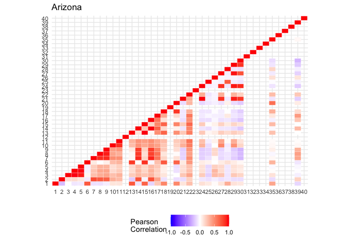<!-- -->

#### Zion

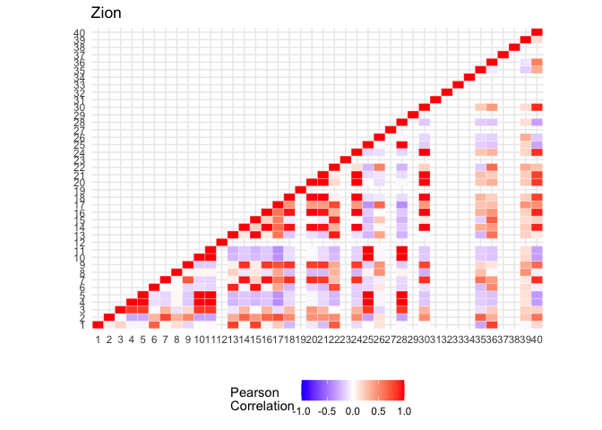<!-- -->

#### Inyo

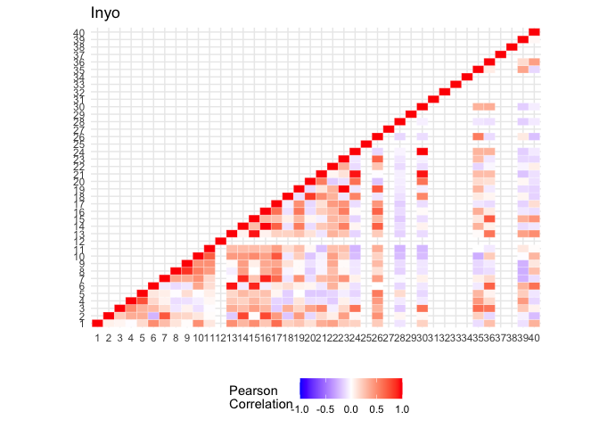<!-- -->

#### Logan

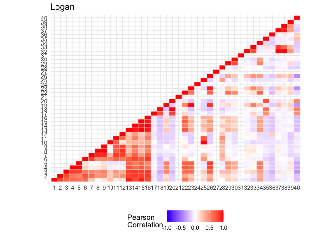<!-- -->

#### Idaho

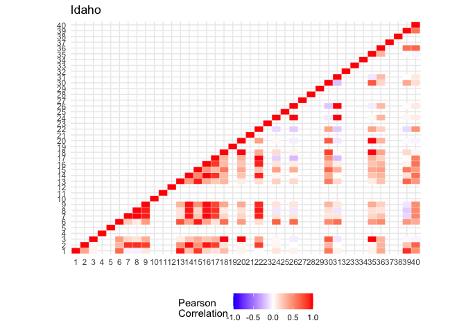<!-- -->

### Heatmaps of correlations of scent by compound group

These are the groupings of the
compounds:

| Code  | Compounds                                                                                                                                                |
| :---- | :------------------------------------------------------------------------------------------------------------------------------------------------------- |
| G.ILE | 2 methylbuyronitrile, nitro-2-methyl butane, cis-2-methylbutyraldoxime, trans-2-methylbutyraldoxime, 2methylbutyl benzoate                               |
| G.LEU | 3methylbutyronitrile, nitro-3-methyl-butane, cis-3-methylbutyraldoxime, trans-3-methylbutyraldoxime                                                      |
| G.VAL | cis-isobutyraldoxime, trans-isobutyraldoxime                                                                                                             |
| G.PHE | 2phenylethanol, phenylacetonitrile, nitrophenylethane, phenylacetaldoxime                                                                                |
| G.OCI | b-myrcene, cis-b-ocimene, trans-b-ocimene, alpha-terpineol                                                                                               |
| G.GER | citronellol, neral, geranial, nerol, geraniol                                                                                                            |
| G.LIN | linalool, cis-furanoid-linalool-oxide, trans-furanoid-linalool-oxide, pyran-lin-oxide-ketone, cis-pyranoid-linalool-oxide, trans-pyranoid-linalool-oxide |
| G.CAR | beta-caryophyllene, alpha-humulene, caryophyllene-oxide                                                                                                  |
| G.SES | beta-farnesene, Z-E-alpha-farnesene, E-E-alpha-farnesene, farnesene-epoxide, farnesol, nerolidol, isophytol                                              |

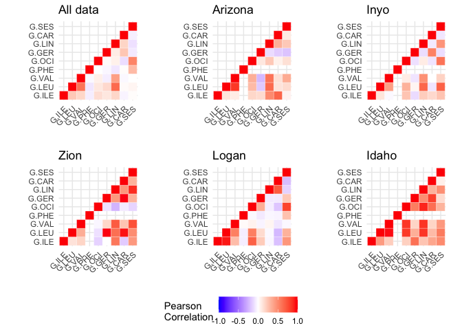<!-- -->

### Heatmaps of morphology

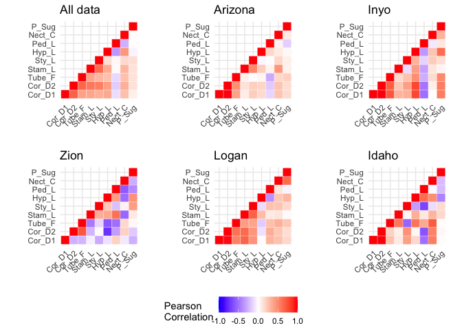<!-- -->

### Heatmaps of morphology & scent by compound group

<!-- -->

## Floral traits that could vary

| Trait                                                            | Approach                                                                                                                                                                                                |
| :--------------------------------------------------------------- | :------------------------------------------------------------------------------------------------------------------------------------------------------------------------------------------------------ |
| Floral scent, total emission rate                                | Linear mixed model analysis across populations of total emission rates in toluene equivalents                                                                                                           |
| Floral scent, compound diversity                                 | Linear mixed model analysis of the number of compounds in samples across populations                                                                                                                    |
| Floral scent, blend composition                                  | Multivariate analysis (e.g. Adonis) plus constrained ordination. *Currently using emission rates in toluene equivalents, will ultimately convert this to emission rates adjusted for response factors.* |
|                                                                  | This can be done two ways: 1. using emission rates from individual compounds, or 2. using emission rates that are the sums of all compounds produced from a certain biosynthetic cluster/table.         |
| Floral scent, emission rates of key compounds or compound groups | 1\. identify what the key compound(s)/compound group(s) are from the constrained ordination.                                                                                                            |
|                                                                  | 2\. linear mixed model analysis to compare across populations.                                                                                                                                          |
| Floral morphology                                                | Multivariate analysis (e.g. Adonis) plus constrained ordination, followed by univariate mixed model analyses of key variables.                                                                          |
| Scent & morphology together                                      | Multivariate analysis (e.g. Adonis) plus constrained ordination                                                                                                                                         |

### Total emission rate

This is total emission rate (per g fresh mass) as a function of
population, with plant nested within population as a random effect. So
this makes use of all measured flowers.

Diagnostics for the model residuals:
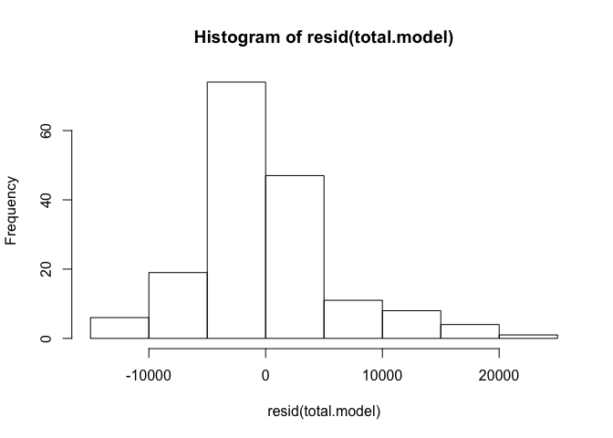<!-- -->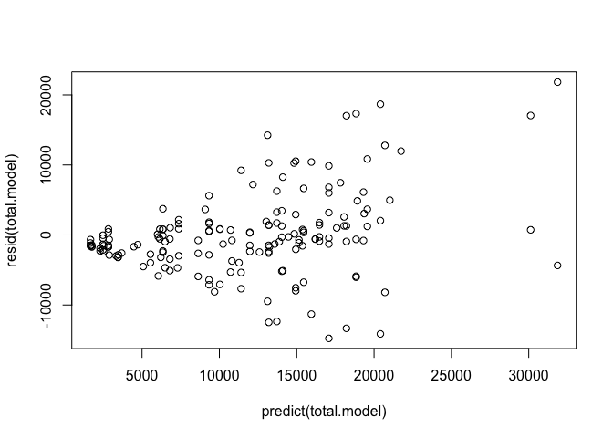<!-- -->

Model
    summary:

    ## Linear mixed model fit by REML. t-tests use Satterthwaite's method [
    ## lmerModLmerTest]
    ## Formula: Comp.Total ~ Population + (1 | Pop_Plant)
    ##    Data: ER_f_mass
    ## 
    ## REML criterion at convergence: 3472.1
    ## 
    ## Scaled residuals: 
    ##     Min      1Q  Median      3Q     Max 
    ## -2.1406 -0.3805 -0.0945  0.2265  3.1638 
    ## 
    ## Random effects:
    ##  Groups    Name        Variance Std.Dev.
    ##  Pop_Plant (Intercept) 41253189 6423    
    ##  Residual              47602593 6899    
    ## Number of obs: 170, groups:  Pop_Plant, 77
    ## 
    ## Fixed effects:
    ##                   Estimate Std. Error       df t value Pr(>|t|)  
    ## (Intercept)        8986.02    3674.54    64.76   2.445   0.0172 *
    ## PopulationLogan   -3062.05    4095.78    65.27  -0.748   0.4574  
    ## PopulationZion     2381.36    4689.80    72.60   0.508   0.6132  
    ## PopulationInyo     7732.06    4292.22    68.50   1.801   0.0760 .
    ## PopulationArizona  5718.66    3984.84    63.94   1.435   0.1561  
    ## ---
    ## Signif. codes:  0 '***' 0.001 '**' 0.01 '*' 0.05 '.' 0.1 ' ' 1
    ## 
    ## Correlation of Fixed Effects:
    ##             (Intr) PpltnL PpltnZ PpltnI
    ## PopulatnLgn -0.897                     
    ## PopulatinZn -0.784  0.703              
    ## PopulatnIny -0.856  0.768  0.671       
    ## PopultnArzn -0.922  0.827  0.723  0.789

ANOVA:

    ## Type III Analysis of Variance Table with Satterthwaite's method
    ##               Sum Sq   Mean Sq NumDF  DenDF F value   Pr(>F)   
    ## Population 932879544 233219886     4 71.518  4.8993 0.001507 **
    ## ---
    ## Signif. codes:  0 '***' 0.001 '**' 0.01 '*' 0.05 '.' 0.1 ' ' 1

Estimated marginal means & contrasts across populations:

    ## $emmeans
    ##  Population emmean   SE   df lower.CL upper.CL
    ##  Idaho        8986 3685 65.0     1626    16346
    ##  Logan        5924 1814 67.6     2304     9544
    ##  Zion        11367 2917 87.5     5570    17164
    ##  Inyo        16718 2222 80.3    12297    21139
    ##  Arizona     14705 1545 59.7    11614    17796
    ## 
    ## Degrees-of-freedom method: kenward-roger 
    ## Confidence level used: 0.95 
    ## 
    ## $contrasts
    ##  contrast        estimate   SE   df t.ratio p.value
    ##  Idaho - Logan       3062 4107 65.5  0.746  0.9448 
    ##  Idaho - Zion       -2381 4700 72.8 -0.507  0.9865 
    ##  Idaho - Inyo       -7732 4303 68.7 -1.797  0.3838 
    ##  Idaho - Arizona    -5719 3996 64.2 -1.431  0.6102 
    ##  Logan - Zion       -5443 3435 81.4 -1.585  0.5113 
    ##  Logan - Inyo      -10794 2868 74.9 -3.763  0.0030 
    ##  Logan - Arizona    -8781 2383 64.2 -3.685  0.0042 
    ##  Zion - Inyo        -5351 3667 84.8 -1.459  0.5915 
    ##  Zion - Arizona     -3337 3301 80.4 -1.011  0.8496 
    ##  Inyo - Arizona      2013 2706 72.8  0.744  0.9453 
    ## 
    ## Degrees-of-freedom method: kenward-roger 
    ## P value adjustment: tukey method for comparing a family of 5 estimates

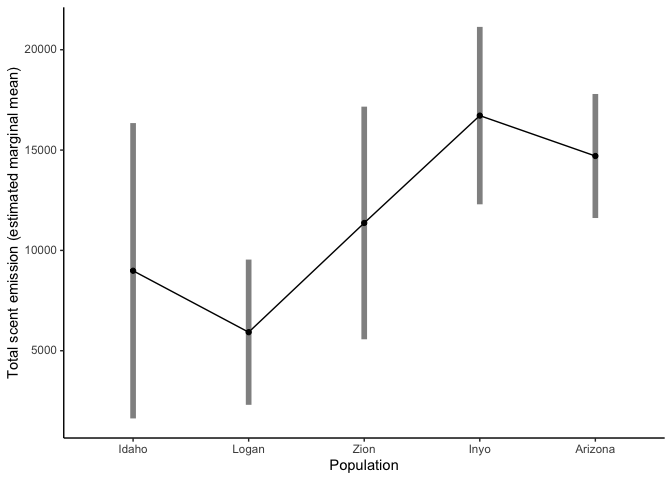<!-- -->

**Interpretation**: total scent shows a roughly clinal pattern. Due to
the amount of variance, the significant contrasts are that Logan has
lower total scent than Inyo or Arizona. Idaho and Zion are intermediate.

### Compound diversity

This is the number of compounds detected in a sample as a function of
population, with plant nested within population as a random effect. So
this makes use of all measured flowers.

Diagnostics for the model residuals:
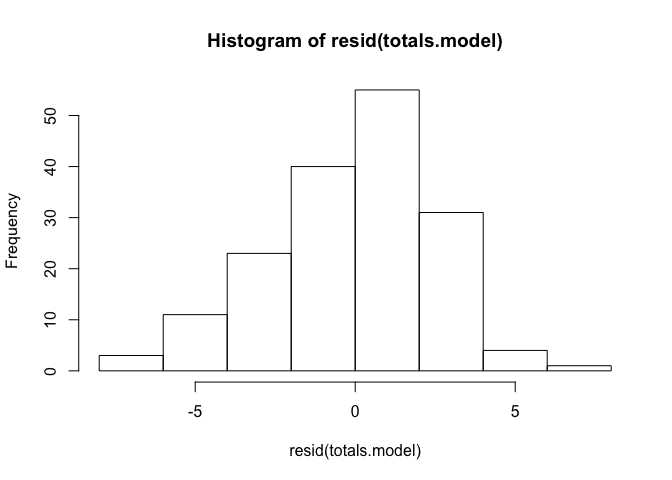<!-- -->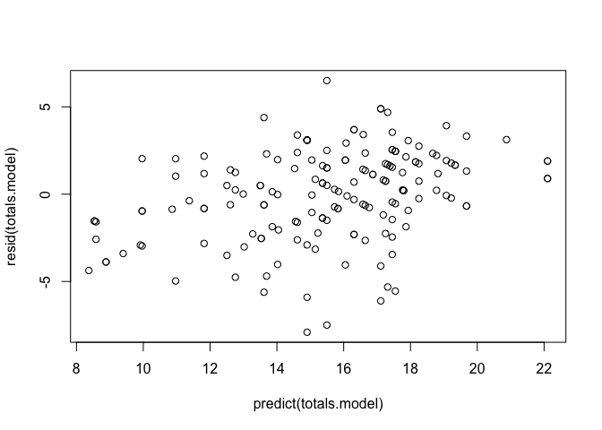<!-- -->

Model
    summary:

    ## Linear mixed model fit by REML. t-tests use Satterthwaite's method [
    ## lmerModLmerTest]
    ## Formula: Total ~ Population + (1 | Pop_Plant)
    ##    Data: P_A_totals
    ## 
    ## REML criterion at convergence: 926
    ## 
    ## Scaled residuals: 
    ##      Min       1Q   Median       3Q      Max 
    ## -2.55150 -0.49758  0.07761  0.61227  2.09936 
    ## 
    ## Random effects:
    ##  Groups    Name        Variance Std.Dev.
    ##  Pop_Plant (Intercept) 10.129   3.183   
    ##  Residual               9.597   3.098   
    ## Number of obs: 168, groups:  Pop_Plant, 77
    ## 
    ## Fixed effects:
    ##                   Estimate Std. Error     df t value Pr(>|t|)    
    ## (Intercept)         11.776      1.761 64.956   6.686 6.22e-09 ***
    ## PopulationLogan      1.207      1.968 65.900   0.613   0.5417    
    ## PopulationZion       3.905      2.241 71.508   1.743   0.0857 .  
    ## PopulationInyo       5.803      2.054 68.098   2.825   0.0062 ** 
    ## PopulationArizona    4.431      1.911 64.163   2.319   0.0236 *  
    ## ---
    ## Signif. codes:  0 '***' 0.001 '**' 0.01 '*' 0.05 '.' 0.1 ' ' 1
    ## 
    ## Correlation of Fixed Effects:
    ##             (Intr) PpltnL PpltnZ PpltnI
    ## PopulatnLgn -0.895                     
    ## PopulatinZn -0.786  0.704              
    ## PopulatnIny -0.857  0.768  0.674       
    ## PopultnArzn -0.922  0.825  0.725  0.790

ANOVA:

    ## Type III Analysis of Variance Table with Satterthwaite's method
    ##            Sum Sq Mean Sq NumDF  DenDF F value   Pr(>F)   
    ## Population 164.99  41.247     4 71.122  4.2979 0.003591 **
    ## ---
    ## Signif. codes:  0 '***' 0.001 '**' 0.01 '*' 0.05 '.' 0.1 ' ' 1

Estimated marginal means & contrasts across populations:

    ## $emmeans
    ##  Population emmean    SE   df lower.CL upper.CL
    ##  Idaho        11.8 1.765 65.6     8.25     15.3
    ##  Logan        13.0 0.879 70.5    11.23     14.7
    ##  Zion         15.7 1.386 84.4    12.92     18.4
    ##  Inyo         17.6 1.058 78.4    15.47     19.7
    ##  Arizona      16.2 0.742 60.5    14.72     17.7
    ## 
    ## Degrees-of-freedom method: kenward-roger 
    ## Confidence level used: 0.95 
    ## 
    ## $contrasts
    ##  contrast        estimate   SE   df t.ratio p.value
    ##  Idaho - Logan     -1.207 1.97 66.5 -0.612  0.9727 
    ##  Idaho - Zion      -3.905 2.24 72.2 -1.740  0.4166 
    ##  Idaho - Inyo      -5.803 2.06 68.8 -2.820  0.0478 
    ##  Idaho - Arizona   -4.431 1.92 64.8 -2.314  0.1538 
    ##  Logan - Zion      -2.698 1.64 80.1 -1.644  0.4744 
    ##  Logan - Inyo      -4.596 1.38 75.1 -3.341  0.0111 
    ##  Logan - Arizona   -3.224 1.15 66.1 -2.802  0.0503 
    ##  Zion - Inyo       -1.898 1.74 82.1 -1.089  0.8119 
    ##  Zion - Arizona    -0.526 1.57 78.3 -0.335  0.9972 
    ##  Inyo - Arizona     1.372 1.29 71.9  1.062  0.8253 
    ## 
    ## Degrees-of-freedom method: kenward-roger 
    ## P value adjustment: tukey method for comparing a family of 5 estimates

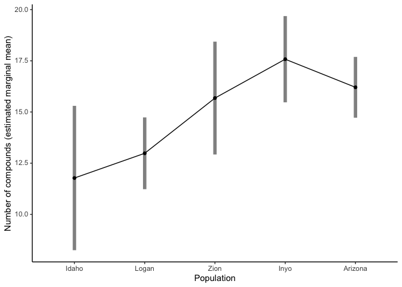<!-- -->

**Interpretation**: The total number of compounds also shows a clinal
pattern. The significant contrasts are that Idaho has fewer compounds
than Inyo, Logan has fewer compounds than Inyo, and Logan has marginally
fewer compounds than Arizona (*P* =
0.0497)

### Floral scent blend composition, multivariate analyses using individual compounds

*Note*: these results could change once we are working with emission
rates adjusted for response factors

    ## 
    ## Call:
    ## adonis(formula = Tol_ord ~ Population, data = Tol_names, permutations = 999,      method = "bray") 
    ## 
    ## Permutation: free
    ## Number of permutations: 999
    ## 
    ## Terms added sequentially (first to last)
    ## 
    ##             Df SumsOfSqs MeanSqs F.Model      R2 Pr(>F)    
    ## Population   4     8.679 2.16979  10.888 0.21086  0.001 ***
    ## Residuals  163    32.482 0.19928         0.78914           
    ## Total      167    41.161                 1.00000           
    ## ---
    ## Signif. codes:  0 '***' 0.001 '**' 0.01 '*' 0.05 '.' 0.1 ' ' 1

There is a significant effect of population and it explains about 21 %
of the variation in scent.

Running a constrained analysis of principle coordinates:

    ## 
    ## Call:
    ## capscale(formula = Tol_ord ~ Population, data = Tol_names, distance = "bray") 
    ## 
    ## Partitioning of squared Bray distance:
    ##               Inertia Proportion
    ## Total          46.821     1.0000
    ## Constrained     8.862     0.1893
    ## Unconstrained  37.959     0.8107
    ## 
    ## Eigenvalues, and their contribution to the squared Bray distance 
    ## 
    ## Importance of components:
    ##                         CAP1    CAP2     CAP3     CAP4   MDS1   MDS2    MDS3
    ## Eigenvalue            6.9019 1.32297 0.384246 0.252877 9.1079 6.0850 3.91502
    ## Proportion Explained  0.1474 0.02826 0.008207 0.005401 0.1945 0.1300 0.08362
    ## Cumulative Proportion 0.1474 0.17567 0.183872 0.189273 0.3838 0.5138 0.59738
    ##                          MDS4    MDS5    MDS6    MDS7    MDS8    MDS9   MDS10
    ## Eigenvalue            2.95294 2.18868 1.75820 1.54016 1.21355 1.04530 0.97259
    ## Proportion Explained  0.06307 0.04675 0.03755 0.03289 0.02592 0.02233 0.02077
    ## Cumulative Proportion 0.66045 0.70719 0.74474 0.77764 0.80356 0.82588 0.84665
    ##                         MDS11   MDS12   MDS13   MDS14  MDS15    MDS16    MDS17
    ## Eigenvalue            0.78102 0.67758 0.59532 0.53559 0.4731 0.414869 0.357521
    ## Proportion Explained  0.01668 0.01447 0.01271 0.01144 0.0101 0.008861 0.007636
    ## Cumulative Proportion 0.86333 0.87781 0.89052 0.90196 0.9121 0.920925 0.928561
    ##                          MDS18  MDS19    MDS20    MDS21    MDS22    MDS23
    ## Eigenvalue            0.354353 0.2809 0.257349 0.244532 0.221743 0.195084
    ## Proportion Explained  0.007568 0.0060 0.005496 0.005223 0.004736 0.004167
    ## Cumulative Proportion 0.936129 0.9421 0.947626 0.952849 0.957585 0.961751
    ##                          MDS24    MDS25    MDS26    MDS27    MDS28    MDS29
    ## Eigenvalue            0.170153 0.142909 0.135207 0.124474 0.119278 0.105581
    ## Proportion Explained  0.003634 0.003052 0.002888 0.002658 0.002548 0.002255
    ## Cumulative Proportion 0.965385 0.968438 0.971325 0.973984 0.976531 0.978786
    ##                          MDS30    MDS31    MDS32    MDS33    MDS34    MDS35
    ## Eigenvalue            0.099575 0.092666 0.084808 0.070174 0.067182 0.057930
    ## Proportion Explained  0.002127 0.001979 0.001811 0.001499 0.001435 0.001237
    ## Cumulative Proportion 0.980913 0.982892 0.984704 0.986202 0.987637 0.988874
    ##                         MDS36    MDS37     MDS38     MDS39     MDS40     MDS41
    ## Eigenvalue            0.05339 0.050786 0.0408325 0.0384256 0.0351385 0.0327479
    ## Proportion Explained  0.00114 0.001085 0.0008721 0.0008207 0.0007505 0.0006994
    ## Cumulative Proportion 0.99001 0.991099 0.9919715 0.9927922 0.9935427 0.9942421
    ##                           MDS42     MDS43     MDS44     MDS45     MDS46
    ## Eigenvalue            0.0305022 0.0277473 0.0238504 0.0229640 0.0195549
    ## Proportion Explained  0.0006515 0.0005926 0.0005094 0.0004905 0.0004177
    ## Cumulative Proportion 0.9948936 0.9954862 0.9959956 0.9964861 0.9969037
    ##                           MDS47     MDS48     MDS49     MDS50     MDS51
    ## Eigenvalue            0.0188108 0.0160844 0.0152896 0.0132788 0.0131607
    ## Proportion Explained  0.0004018 0.0003435 0.0003266 0.0002836 0.0002811
    ## Cumulative Proportion 0.9973055 0.9976490 0.9979755 0.9982592 0.9985402
    ##                           MDS52     MDS53     MDS54     MDS55     MDS56
    ## Eigenvalue            0.0106415 0.0095623 0.0090038 0.0072015 0.0067816
    ## Proportion Explained  0.0002273 0.0002042 0.0001923 0.0001538 0.0001448
    ## Cumulative Proportion 0.9987675 0.9989717 0.9991641 0.9993179 0.9994627
    ##                           MDS57     MDS58     MDS59     MDS60     MDS61
    ## Eigenvalue            0.0059235 4.176e-03 3.629e-03 2.946e-03 2.398e-03
    ## Proportion Explained  0.0001265 8.919e-05 7.751e-05 6.292e-05 5.122e-05
    ## Cumulative Proportion 0.9995892 9.997e-01 9.998e-01 9.998e-01 9.999e-01
    ##                           MDS62     MDS63     MDS64     MDS65     MDS66
    ## Eigenvalue            2.125e-03 0.0014421 8.689e-04 7.270e-04 5.624e-04
    ## Proportion Explained  4.539e-05 0.0000308 1.856e-05 1.553e-05 1.201e-05
    ## Cumulative Proportion 9.999e-01 0.9999462 1.000e+00 1.000e+00 1.000e+00
    ##                           MDS67     MDS68
    ## Eigenvalue            3.410e-04 1.768e-05
    ## Proportion Explained  7.284e-06 3.777e-07
    ## Cumulative Proportion 1.000e+00 1.000e+00
    ## 
    ## Accumulated constrained eigenvalues
    ## Importance of components:
    ##                         CAP1   CAP2    CAP3    CAP4
    ## Eigenvalue            6.9019 1.3230 0.38425 0.25288
    ## Proportion Explained  0.7788 0.1493 0.04336 0.02854
    ## Cumulative Proportion 0.7788 0.9281 0.97146 1.00000
    ## 
    ## Scaling 2 for species and site scores
    ## * Species are scaled proportional to eigenvalues
    ## * Sites are unscaled: weighted dispersion equal on all dimensions
    ## * General scaling constant of scores:

The constrained portion explains about 19% of overall distance. CAP1
explains about 14% and CAP2 expalins about 3% of overall distance.

Plotting the capscale:
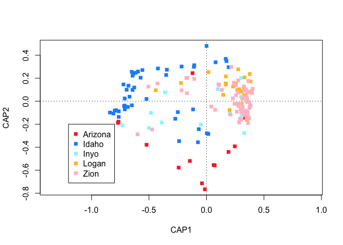<!-- -->

Checking to see which compound group(s) are significantly correlated
with CAP1 and/or
CAP2.

| compounds                          | cor1     |     p1 | cor2     |     p2 | sig1 | sig2 |
| :--------------------------------- | :------- | -----: | :------- | -----: | :--- | :--- |
| Comp.2methylbutyronitrile          | 0.2373   | 0.0053 | \-0.5941 | 0.0000 | Yes  | Yes  |
| Comp.3methylbutyronitrile          | 0.4535   | 0.0000 | 0.022    | 0.8373 | Yes  | No   |
| Comp.b-myrcene                     | 0.0285   | 0.7719 | \-0.1455 | 0.2261 | No   | No   |
| Comp.cis-b-ocimene                 | 0.015    | 0.8684 | \-0.0455 | 0.6561 | No   | No   |
| Comp.trans-b-ocimene               | 0.0717   | 0.4186 | \-0.0202 | 0.8373 | No   | No   |
| Comp.nitro-2-methyl-butane         | 0.3705   | 0.0000 | \-0.642  | 0.0000 | Yes  | Yes  |
| Comp.nitro-3-methyl-butane         | 0.4284   | 0.0000 | \-0.0122 | 0.8979 | Yes  | No   |
| Comp.trans-isobutyraldoxime        | 0.2897   | 0.0003 | \-0.1054 | 0.2900 | Yes  | No   |
| Comp.cis-isobutyraldoxime          | 0.3043   | 0.0003 | \-0.1397 | 0.2261 | Yes  | No   |
| Comp.cis-furanoid-linalool-oxide   | \-0.0801 | 0.3662 | \-0.1166 | 0.2644 | No   | No   |
| Comp.trans-furanoid-linalool-oxide | \-0.1036 | 0.2339 | \-0.191  | 0.0754 | No   | No   |
| Comp.pyran-lin-oxide-ketone        | \-0.1184 | 0.1806 | \-0.175  | 0.1165 | No   | No   |
| Comp.trans-2-methylbutyraldoxime   | 0.3324   | 0.0000 | \-0.7002 | 0.0000 | Yes  | Yes  |
| Comp.trans-3-methylbutyraldoxime   | 0.5219   | 0.0000 | \-0.1204 | 0.2531 | Yes  | No   |
| Comp.cis-2-methylbutyraldoxime     | 0.3182   | 0.0000 | \-0.6877 | 0.0000 | Yes  | Yes  |
| Comp.cis-3-methylbutyraldoxime     | 0.4778   | 0.0000 | \-0.0799 | 0.4179 | Yes  | No   |
| Comp.linalool                      | 0.674    | 0.0000 | 0.1352   | 0.2261 | Yes  | No   |
| Comp.beta-caryophyllene            | 0.0177   | 0.8627 | 0.1335   | 0.2261 | No   | No   |
| Comp.beta-farnesene                | \-0.1192 | 0.1806 | 0.1438   | 0.2261 | No   | No   |
| Comp.alpha-humulene                | 0.0596   | 0.5062 | 0.1203   | 0.2531 | No   | No   |
| Comp.neral                         | 0.137    | 0.1277 | \-0.0351 | 0.7236 | No   | No   |
| Comp.alpha-terpineol               | 0.428    | 0.0000 | \-0.1086 | 0.2805 | Yes  | No   |
| Comp.Z-E-alpha-farnesene           | \-0.0946 | 0.2782 | 0.1087   | 0.2805 | No   | No   |
| Comp.geranial                      | 0.1588   | 0.0824 | \-0.088  | 0.3800 | No   | No   |
| Comp.cis-pyranoid-linalool-oxide   | \-0.1145 | 0.1860 | \-0.1008 | 0.3099 | No   | No   |
| Comp.E-E-alpha-farnesene           | \-0.197  | 0.0247 | 0.1405   | 0.2261 | No   | No   |
| Comp.citronellol                   | 0.1219   | 0.1777 | \-0.0647 | 0.4908 | No   | No   |
| Comp.trans-pyranoid-linalool-oxide | \-0.1395 | 0.1277 | \-0.0823 | 0.4130 | No   | No   |
| Comp.nerol                         | 0.1456   | 0.1135 | \-0.0664 | 0.4905 | No   | No   |
| Comp.geraniol                      | 0.1591   | 0.0824 | \-0.0726 | 0.4515 | No   | No   |
| Comp.2methylbutyl-benzoate         | \-0.0028 | 0.9715 | \-0.2875 | 0.0016 | No   | Yes  |
| Comp.2phenylethanol                | \-0.1383 | 0.1277 | 0.109    | 0.2805 | No   | No   |
| Comp.phenylacetonitrile            | \-0.2218 | 0.0098 | 0.2402   | 0.0113 | Yes  | No   |
| Comp.farnesene-epoxide             | \-0.1577 | 0.0824 | 0.009    | 0.9074 | No   | No   |
| Comp.caryophyllene-oxide           | \-0.0383 | 0.6914 | 0.122    | 0.2531 | No   | No   |
| Comp.nerolidol                     | \-0.2899 | 0.0003 | \-0.1223 | 0.2531 | Yes  | No   |
| Comp.nitrophenylethane             | \-0.1337 | 0.1342 | 0.1334   | 0.2261 | No   | No   |
| Comp.phenylacetaldoxime            | \-0.1165 | 0.1830 | 0.0969   | 0.3255 | No   | No   |
| Comp.isophytol                     | 0.3319   | 0.0000 | 0.0422   | 0.6709 | Yes  | No   |
| Comp.farnesol                      | \-0.2929 | 0.0003 | \-0.0757 | 0.4395 | Yes  | No   |

Correlated with CAP 1: 2methylbutyronitrile (+), 3methylbutyronitrile
(+), nitro-2-methyl-butane (+), nitro-3-methyl-butane (+),
trans-isobutyraldoxime (+), cis-isobutyraldoxime (+),
trans-2-methylbutyraldoxime (+), trans-3-methylbutyraldoxime (+),
cis-2-methylbutyraldoxime (+), cis-3-methylbutyraldoxime (+), linalool
(+), alpha-terpineol (+), phenylacetonitrile (-), nerolidol (-),
isophytol (+), farnesol (-).

Correlated with CAP 2: 2methylbutyronitrile (-), nitro-2-methyl-butane
(-), trans-2-methylbutyraldoxime (-), cis-2-methylbutyraldoxime (-),
2methylbutyl-benzoate
(-).

### Floral scent blend composition, multivariate analyses using groupings by biosynthetic pathway

*Note*: these results could change once we are working with emission
rates adjusted for response factors

These are the groupings of the
compounds:

| Code  | Compounds                                                                                                                                                |
| :---- | :------------------------------------------------------------------------------------------------------------------------------------------------------- |
| G.ILE | 2 methylbuyronitrile, nitro-2-methyl butane, cis-2-methylbutyraldoxime, trans-2-methylbutyraldoxime, 2methylbutyl benzoate                               |
| G.LEU | 3methylbutyronitrile, nitro-3-methyl-butane, cis-3-methylbutyraldoxime, trans-3-methylbutyraldoxime                                                      |
| G.VAL | cis-isobutyraldoxime, trans-isobutyraldoxime                                                                                                             |
| G.PHE | 2phenylethanol, phenylacetonitrile, nitrophenylethane, phenylacetaldoxime                                                                                |
| G.OCI | b-myrcene, cis-b-ocimene, trans-b-ocimene, alpha-terpineol                                                                                               |
| G.GER | citronellol, neral, geranial, nerol, geraniol                                                                                                            |
| G.LIN | linalool, cis-furanoid-linalool-oxide, trans-furanoid-linalool-oxide, pyran-lin-oxide-ketone, cis-pyranoid-linalool-oxide, trans-pyranoid-linalool-oxide |
| G.CAR | beta-caryophyllene, alpha-humulene, caryophyllene-oxide                                                                                                  |
| G.SES | beta-farnesene, Z-E-alpha-farnesene, E-E-alpha-farnesene, farnesene-epoxide, farnesol, nerolidol, isophytol                                              |

First, running an adonis (comparable to ANOSIM):

    ## 
    ## Call:
    ## adonis(formula = ER_f_mass_group_data ~ Population, data = ER_f_mass_groups,      permutations = 999, method = "bray") 
    ## 
    ## Permutation: free
    ## Number of permutations: 999
    ## 
    ## Terms added sequentially (first to last)
    ## 
    ##             Df SumsOfSqs MeanSqs F.Model     R2 Pr(>F)    
    ## Population   4     8.296 2.07396  10.989 0.2124  0.001 ***
    ## Residuals  163    30.762 0.18873         0.7876           
    ## Total      167    39.058                 1.0000           
    ## ---
    ## Signif. codes:  0 '***' 0.001 '**' 0.01 '*' 0.05 '.' 0.1 ' ' 1

*Interpretation*: The adonis shows a significant effect of population,
which explains about 21 % of the variance in scent blend composition.

Running a constrained analysis of principle coordinates:

    ## 
    ## Call:
    ## capscale(formula = ER_f_mass_group_data ~ Population, data = ER_f_mass_groups,      distance = "bray") 
    ## 
    ## Partitioning of squared Bray distance:
    ##               Inertia Proportion
    ## Total          44.757     1.0000
    ## Constrained     8.496     0.1898
    ## Unconstrained  36.261     0.8102
    ## 
    ## Eigenvalues, and their contribution to the squared Bray distance 
    ## 
    ## Importance of components:
    ##                         CAP1    CAP2     CAP3     CAP4   MDS1   MDS2    MDS3
    ## Eigenvalue            6.4486 1.38334 0.410119 0.254159 9.3680 6.6820 3.75770
    ## Proportion Explained  0.1441 0.03091 0.009163 0.005679 0.2093 0.1493 0.08396
    ## Cumulative Proportion 0.1441 0.17499 0.184150 0.189829 0.3991 0.5484 0.63239
    ##                          MDS4    MDS5    MDS6    MDS7    MDS8    MDS9   MDS10
    ## Eigenvalue            2.57208 2.14636 1.73698 1.23381 1.11262 1.05079 0.73154
    ## Proportion Explained  0.05747 0.04796 0.03881 0.02757 0.02486 0.02348 0.01634
    ## Cumulative Proportion 0.68986 0.73781 0.77662 0.80419 0.82905 0.85252 0.86887
    ##                         MDS11   MDS12   MDS13   MDS14    MDS15   MDS16    MDS17
    ## Eigenvalue            0.70426 0.54891 0.49583 0.44799 0.401672 0.34819 0.309869
    ## Proportion Explained  0.01574 0.01226 0.01108 0.01001 0.008974 0.00778 0.006923
    ## Cumulative Proportion 0.88460 0.89687 0.90795 0.91796 0.926929 0.93471 0.941632
    ##                          MDS18    MDS19    MDS20   MDS21    MDS22    MDS23
    ## Eigenvalue            0.258755 0.242014 0.207976 0.19288 0.181509 0.159000
    ## Proportion Explained  0.005781 0.005407 0.004647 0.00431 0.004055 0.003553
    ## Cumulative Proportion 0.947414 0.952821 0.957468 0.96178 0.965833 0.969385
    ##                          MDS24    MDS25    MDS26   MDS27    MDS28    MDS29
    ## Eigenvalue            0.134483 0.117887 0.112882 0.10428 0.098593 0.076248
    ## Proportion Explained  0.003005 0.002634 0.002522 0.00233 0.002203 0.001704
    ## Cumulative Proportion 0.972390 0.975024 0.977546 0.97988 0.982079 0.983782
    ##                          MDS30    MDS31    MDS32    MDS33    MDS34    MDS35
    ## Eigenvalue            0.068703 0.065234 0.060941 0.056455 0.048112 0.045942
    ## Proportion Explained  0.001535 0.001458 0.001362 0.001261 0.001075 0.001026
    ## Cumulative Proportion 0.985317 0.986775 0.988136 0.989398 0.990473 0.991499
    ##                           MDS36     MDS37     MDS38     MDS39     MDS40
    ## Eigenvalue            0.0414773 0.0361344 0.0332603 0.0305310 0.0276648
    ## Proportion Explained  0.0009267 0.0008073 0.0007431 0.0006821 0.0006181
    ## Cumulative Proportion 0.9924258 0.9932332 0.9939763 0.9946585 0.9952766
    ##                           MDS41     MDS42     MDS43     MDS44     MDS45
    ## Eigenvalue            0.0262145 0.0230895 0.0196186 0.0176009 0.0173172
    ## Proportion Explained  0.0005857 0.0005159 0.0004383 0.0003933 0.0003869
    ## Cumulative Proportion 0.9958623 0.9963782 0.9968165 0.9972097 0.9975967
    ##                           MDS46     MDS47     MDS48     MDS49     MDS50
    ## Eigenvalue            0.0133787 0.0124147 0.0114517 0.0106146 0.0092099
    ## Proportion Explained  0.0002989 0.0002774 0.0002559 0.0002372 0.0002058
    ## Cumulative Proportion 0.9978956 0.9981729 0.9984288 0.9986660 0.9988717
    ##                           MDS51     MDS52     MDS53     MDS54     MDS55
    ## Eigenvalue            0.0088314 0.0079024 0.0070607 0.0054538 0.0046521
    ## Proportion Explained  0.0001973 0.0001766 0.0001578 0.0001219 0.0001039
    ## Cumulative Proportion 0.9990691 0.9992456 0.9994034 0.9995252 0.9996292
    ##                           MDS56     MDS57     MDS58     MDS59     MDS60
    ## Eigenvalue            3.860e-03 3.404e-03 3.102e-03 2.302e-03 1.904e-03
    ## Proportion Explained  8.624e-05 7.605e-05 6.932e-05 5.143e-05 4.253e-05
    ## Cumulative Proportion 9.997e-01 9.998e-01 9.999e-01 9.999e-01 1.000e+00
    ##                           MDS61     MDS62     MDS63     MDS64
    ## Eigenvalue            0.0011952 6.184e-04 2.087e-04 2.839e-06
    ## Proportion Explained  0.0000267 1.382e-05 4.662e-06 6.344e-08
    ## Cumulative Proportion 0.9999815 1.000e+00 1.000e+00 1.000e+00
    ## 
    ## Accumulated constrained eigenvalues
    ## Importance of components:
    ##                        CAP1   CAP2    CAP3    CAP4
    ## Eigenvalue            6.449 1.3833 0.41012 0.25416
    ## Proportion Explained  0.759 0.1628 0.04827 0.02991
    ## Cumulative Proportion 0.759 0.9218 0.97009 1.00000
    ## 
    ## Scaling 2 for species and site scores
    ## * Species are scaled proportional to eigenvalues
    ## * Sites are unscaled: weighted dispersion equal on all dimensions
    ## * General scaling constant of scores:

The constrained portion explains about 19% of overall distance. CAP1
explains about 14% and CAP2 expalins about 3% of overall distance.

Plotting the capscale:
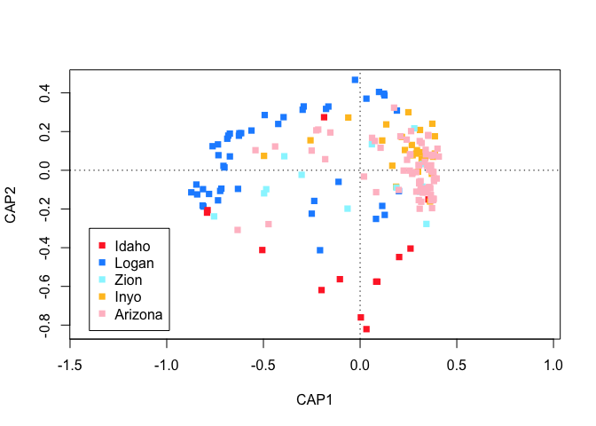<!-- -->

Checking to see which compound group(s) are significantly correlated
with CAP1 and/or CAP2.

| compounds | cor1     |     p1 | cor2     |     p2 | sig1 | sig2 |
| :-------- | :------- | -----: | :------- | -----: | :--- | :--- |
| G.ILE     | 0.3541   | 0.0000 | \-0.6959 | 0.0000 | Yes  | Yes  |
| G.LEU     | 0.515    | 0.0000 | \-0.1206 | 0.2685 | Yes  | No   |
| G.VAL     | 0.3264   | 0.0000 | \-0.095  | 0.3307 | Yes  | No   |
| G.PHE     | \-0.1395 | 0.0918 | 0.0996   | 0.3307 | No   | No   |
| G.OCI     | 0.0848   | 0.3086 | \-0.0598 | 0.4410 | No   | No   |
| G.GER     | 0.1594   | 0.0585 | \-0.0686 | 0.4410 | No   | No   |
| G.LIN     | 0.6731   | 0.0000 | 0.1379   | 0.2606 | Yes  | No   |
| G.CAR     | 7e-04    | 0.9925 | 0.1325   | 0.2606 | No   | No   |
| G.SES     | \-0.203  | 0.0150 | 0.0617   | 0.4410 | No   | No   |

This table indicates that four compound groups are correlated with CAP1
at P adjusted \< 0.01 : ILE, LEU, VAL, and LIN. ILE is the only compound
group correlated with CAP2.

### Floral scent, univariate analyses of key compounds

*Waiting to do this until we have finalized emission rates adjusted for
response factors*

### Floral scent, univariate analyses of key compound groups

*Note*: these results could change once we are working with emission
rates adjusted for response factors. Also will need to check for p-value
adjustments for performing mulitple tests (e.g. one test for each
compound group).

For each compound group that was correlated with CAP1 and/or CAP2, the
emission rate is modeled as a function of population, with plant nested
within population as a random effect. This uses data from all measured
flowers.

**ILE group**:

Diagnostics for the model residuals:
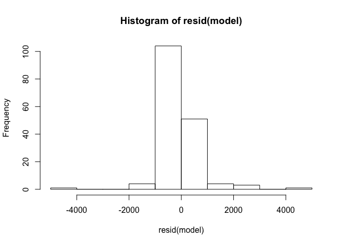<!-- -->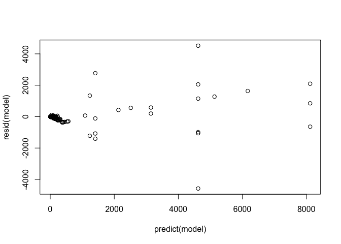<!-- -->

Model
    summary:

    ## Linear mixed model fit by REML. t-tests use Satterthwaite's method [
    ## lmerModLmerTest]
    ## Formula: G.SES ~ Population + (1 | Pop_Plant)
    ##    Data: ER_f_mass_groups
    ## 
    ## REML criterion at convergence: 2811.6
    ## 
    ## Scaled residuals: 
    ##     Min      1Q  Median      3Q     Max 
    ## -5.3586 -0.1347 -0.0075  0.0032  5.2888 
    ## 
    ## Random effects:
    ##  Groups    Name        Variance Std.Dev.
    ##  Pop_Plant (Intercept) 2115879  1454.6  
    ##  Residual               729697   854.2  
    ## Number of obs: 168, groups:  Pop_Plant, 77
    ## 
    ## Fixed effects:
    ##                   Estimate Std. Error       df t value Pr(>|t|)  
    ## (Intercept)         64.304    714.379   71.112   0.090   0.9285  
    ## PopulationLogan   1363.192    796.445   71.634   1.712   0.0913 .
    ## PopulationZion       1.073    898.395   73.702   0.001   0.9991  
    ## PopulationInyo     826.893    828.379   72.399   0.998   0.3215  
    ## PopulationArizona  -49.431    776.404   70.647  -0.064   0.9494  
    ## ---
    ## Signif. codes:  0 '***' 0.001 '**' 0.01 '*' 0.05 '.' 0.1 ' ' 1
    ## 
    ## Correlation of Fixed Effects:
    ##             (Intr) PpltnL PpltnZ PpltnI
    ## PopulatnLgn -0.897                     
    ## PopulatinZn -0.795  0.713              
    ## PopulatnIny -0.862  0.774  0.686       
    ## PopultnArzn -0.920  0.825  0.732  0.793

ANOVA:

    ## Type III Analysis of Variance Table with Satterthwaite's method
    ##             Sum Sq Mean Sq NumDF  DenDF F value  Pr(>F)  
    ## Population 8179119 2044780     4 73.677  2.8022 0.03181 *
    ## ---
    ## Signif. codes:  0 '***' 0.001 '**' 0.01 '*' 0.05 '.' 0.1 ' ' 1

Estimated marginal means & contrasts across populations:

    ## $emmeans
    ##  Population emmean  SE   df lower.CL upper.CL
    ##  Idaho        64.3 715 70.0  -1361.2     1490
    ##  Logan      1427.5 352 72.7    725.3     2130
    ##  Zion         65.4 545 77.2  -1019.6     1150
    ##  Inyo        891.2 420 75.1     55.5     1727
    ##  Arizona      14.9 304 67.0   -592.3      622
    ## 
    ## Degrees-of-freedom method: kenward-roger 
    ## Confidence level used: 0.95 
    ## 
    ## $contrasts
    ##  contrast        estimate  SE   df t.ratio p.value
    ##  Idaho - Logan   -1363.19 797 70.5 -1.711  0.4341 
    ##  Idaho - Zion       -1.07 899 72.5 -0.001  1.0000 
    ##  Idaho - Inyo     -826.89 829 71.2 -0.998  0.8555 
    ##  Idaho - Arizona    49.43 777 69.5  0.064  1.0000 
    ##  Logan - Zion     1362.12 649 75.8  2.099  0.2311 
    ##  Logan - Inyo      536.30 548 74.1  0.979  0.8639 
    ##  Logan - Arizona  1412.62 465 70.2  3.035  0.0270 
    ##  Zion - Inyo      -825.82 688 76.4 -1.201  0.7508 
    ##  Zion - Arizona     50.50 624 74.7  0.081  1.0000 
    ##  Inyo - Arizona    876.32 518 72.2  1.691  0.4458 
    ## 
    ## Degrees-of-freedom method: kenward-roger 
    ## P value adjustment: tukey method for comparing a family of 5 estimates

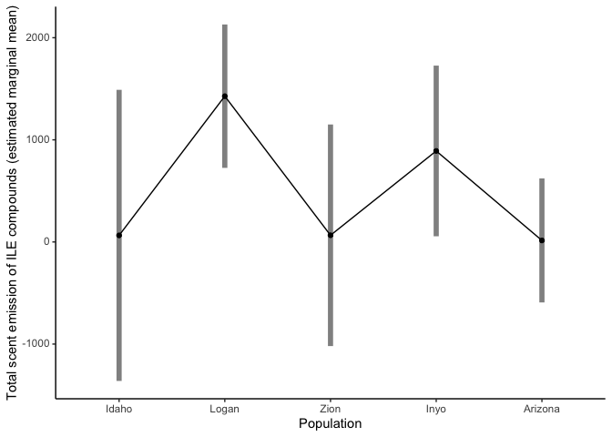<!-- -->

*Interpretation*: Idaho has higher ILE emissions than Logan. All other
contrasts are non-significant.

**LEU group**:

Diagnostics for the model residuals:
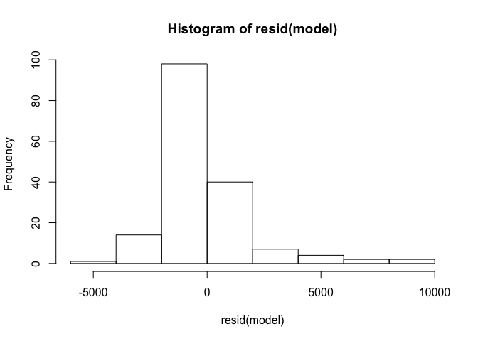<!-- -->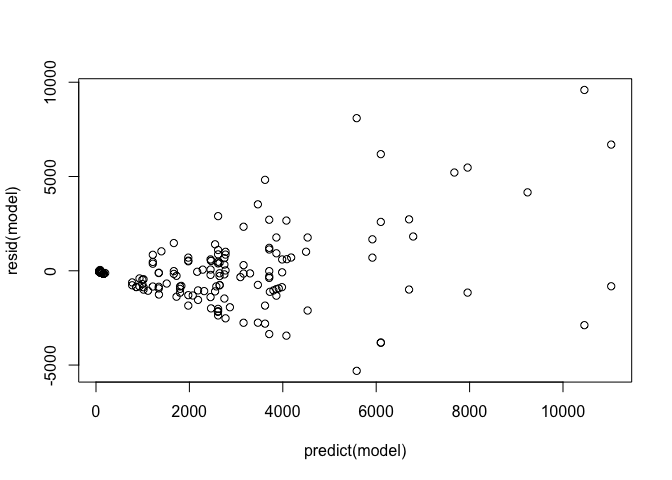<!-- -->

Untransformed residuals look okay, square root transformation (not
shown) is comparable and doesn’t affect the results.

Model
    summary:

    ## Linear mixed model fit by REML. t-tests use Satterthwaite's method [
    ## lmerModLmerTest]
    ## Formula: G.LEU ~ Population + (1 | Pop_Plant)
    ##    Data: ER_f_mass_groups
    ## 
    ## REML criterion at convergence: 3081.7
    ## 
    ## Scaled residuals: 
    ##     Min      1Q  Median      3Q     Max 
    ## -2.2990 -0.3765 -0.0518  0.2097  4.1544 
    ## 
    ## Random effects:
    ##  Groups    Name        Variance Std.Dev.
    ##  Pop_Plant (Intercept) 5574700  2361    
    ##  Residual              5329222  2309    
    ## Number of obs: 168, groups:  Pop_Plant, 77
    ## 
    ## Fixed effects:
    ##                   Estimate Std. Error       df t value Pr(>|t|)  
    ## (Intercept)        2665.86    1308.57    60.73   2.037    0.046 *
    ## PopulationLogan   -2344.83    1461.85    61.65  -1.604    0.114  
    ## PopulationZion     -443.34    1664.83    67.20  -0.266    0.791  
    ## PopulationInyo     2224.66    1526.15    63.82   1.458    0.150  
    ## PopulationArizona   777.06    1419.63    59.96   0.547    0.586  
    ## ---
    ## Signif. codes:  0 '***' 0.001 '**' 0.01 '*' 0.05 '.' 0.1 ' ' 1
    ## 
    ## Correlation of Fixed Effects:
    ##             (Intr) PpltnL PpltnZ PpltnI
    ## PopulatnLgn -0.895                     
    ## PopulatinZn -0.786  0.704              
    ## PopulatnIny -0.857  0.768  0.674       
    ## PopultnArzn -0.922  0.825  0.725  0.790

ANOVA:

    ## Type III Analysis of Variance Table with Satterthwaite's method
    ##               Sum Sq  Mean Sq NumDF  DenDF F value    Pr(>F)    
    ## Population 123344474 30836118     4 66.813  5.7862 0.0004641 ***
    ## ---
    ## Signif. codes:  0 '***' 0.001 '**' 0.01 '*' 0.05 '.' 0.1 ' ' 1

Estimated marginal means & contrasts across populations:

    ## $emmeans
    ##  Population emmean   SE   df lower.CL upper.CL
    ##  Idaho        2666 1312 65.5     46.9     5285
    ##  Logan         321  653 70.5   -981.5     1624
    ##  Zion         2223 1030 84.5    174.4     4271
    ##  Inyo         4891  786 78.5   3325.1     6456
    ##  Arizona      3443  551 60.5   2340.1     4546
    ## 
    ## Degrees-of-freedom method: kenward-roger 
    ## Confidence level used: 0.95 
    ## 
    ## $contrasts
    ##  contrast        estimate   SE   df t.ratio p.value
    ##  Idaho - Logan       2345 1465 66.5  1.600  0.5025 
    ##  Idaho - Zion         443 1668 72.2  0.266  0.9989 
    ##  Idaho - Inyo       -2225 1529 68.7 -1.455  0.5949 
    ##  Idaho - Arizona     -777 1423 64.8 -0.546  0.9820 
    ##  Logan - Zion       -1901 1220 80.2 -1.559  0.5278 
    ##  Logan - Inyo       -4569 1022 75.1 -4.470  0.0003 
    ##  Logan - Arizona    -3122  855 66.1 -3.652  0.0045 
    ##  Zion - Inyo        -2668 1296 82.2 -2.059  0.2480 
    ##  Zion - Arizona     -1220 1168 78.3 -1.045  0.8338 
    ##  Inyo - Arizona      1448  960 71.9  1.507  0.5612 
    ## 
    ## Degrees-of-freedom method: kenward-roger 
    ## P value adjustment: tukey method for comparing a family of 5 estimates

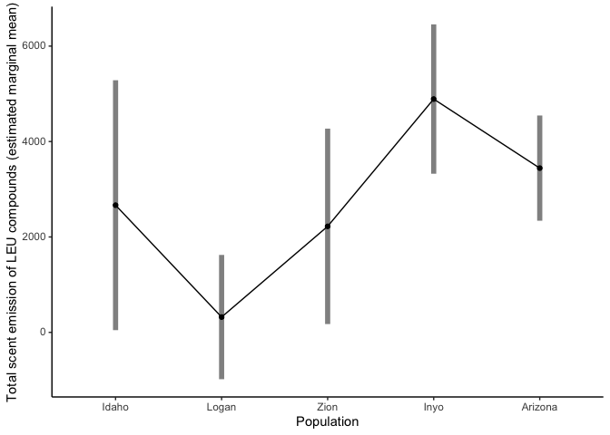<!-- -->

*Interpretation*: Inyo and Arizona have higher emission rates of LEU
compounds relative to Logan.

**VAL group**:

Diagnostics for the model residuals:
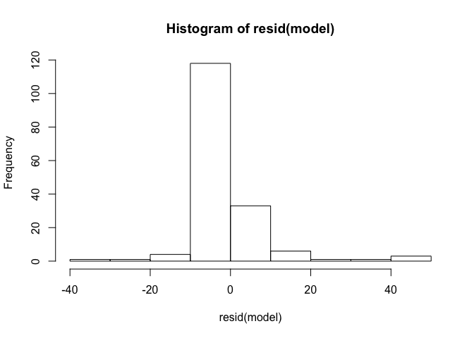<!-- -->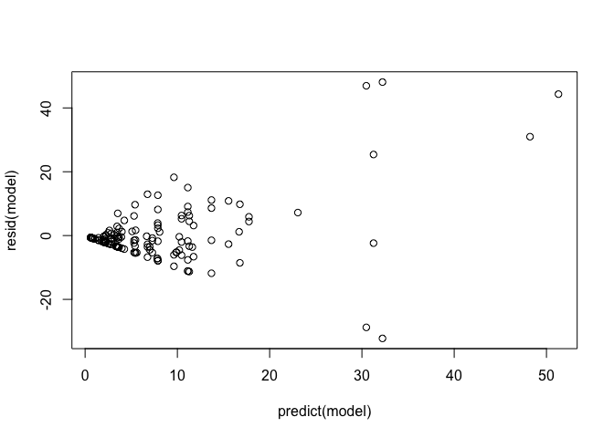<!-- -->

Untransformed residuals look okay, square root transformation (not
shown) is comparable and doesn’t affect the results.

Model
    summary:

    ## Linear mixed model fit by REML. t-tests use Satterthwaite's method [
    ## lmerModLmerTest]
    ## Formula: G.VAL ~ Population + (1 | Pop_Plant)
    ##    Data: ER_f_mass_groups
    ## 
    ## REML criterion at convergence: 1335.3
    ## 
    ## Scaled residuals: 
    ##     Min      1Q  Median      3Q     Max 
    ## -2.9658 -0.3082 -0.1300  0.0357  4.4262 
    ## 
    ## Random effects:
    ##  Groups    Name        Variance Std.Dev.
    ##  Pop_Plant (Intercept) 124.9    11.18   
    ##  Residual              118.1    10.87   
    ## Number of obs: 168, groups:  Pop_Plant, 77
    ## 
    ## Fixed effects:
    ##                   Estimate Std. Error     df t value Pr(>|t|)  
    ## (Intercept)         11.258      6.184 44.193   1.821   0.0755 .
    ## PopulationLogan     -6.857      6.908 44.972  -0.993   0.3262  
    ## PopulationZion      -7.533      7.866 49.700  -0.958   0.3429  
    ## PopulationInyo       4.180      7.211 46.805   0.580   0.5649  
    ## PopulationArizona   -4.366      6.709 43.542  -0.651   0.5186  
    ## ---
    ## Signif. codes:  0 '***' 0.001 '**' 0.01 '*' 0.05 '.' 0.1 ' ' 1
    ## 
    ## Correlation of Fixed Effects:
    ##             (Intr) PpltnL PpltnZ PpltnI
    ## PopulatnLgn -0.895                     
    ## PopulatinZn -0.786  0.704              
    ## PopulatnIny -0.858  0.768  0.674       
    ## PopultnArzn -0.922  0.825  0.725  0.790

ANOVA:

    ## Type III Analysis of Variance Table with Satterthwaite's method
    ##            Sum Sq Mean Sq NumDF  DenDF F value Pr(>F)
    ## Population 778.59  194.65     4 49.362  1.6484 0.1771

Estimated marginal means & contrasts across populations:

    ## $emmeans
    ##  Population emmean   SE   df lower.CL upper.CL
    ##  Idaho       11.26 6.20 65.6    -1.12     23.6
    ##  Logan        4.40 3.09 70.5    -1.75     10.6
    ##  Zion         3.72 4.87 84.3    -5.95     13.4
    ##  Inyo        15.44 3.71 78.4     8.04     22.8
    ##  Arizona      6.89 2.61 60.5     1.68     12.1
    ## 
    ## Degrees-of-freedom method: kenward-roger 
    ## Confidence level used: 0.95 
    ## 
    ## $contrasts
    ##  contrast        estimate   SE   df t.ratio p.value
    ##  Idaho - Logan      6.857 6.92 66.6  0.990  0.8588 
    ##  Idaho - Zion       7.533 7.88 72.2  0.956  0.8737 
    ##  Idaho - Inyo      -4.180 7.23 68.8 -0.579  0.9778 
    ##  Idaho - Arizona    4.366 6.72 64.8  0.649  0.9662 
    ##  Logan - Zion       0.676 5.76 80.1  0.117  1.0000 
    ##  Logan - Inyo     -11.037 4.83 75.1 -2.285  0.1611 
    ##  Logan - Arizona   -2.491 4.04 66.2 -0.617  0.9719 
    ##  Zion - Inyo      -11.713 6.12 82.1 -1.914  0.3185 
    ##  Zion - Arizona    -3.167 5.52 78.3 -0.574  0.9785 
    ##  Inyo - Arizona     8.546 4.54 72.0  1.883  0.3356 
    ## 
    ## Degrees-of-freedom method: kenward-roger 
    ## P value adjustment: tukey method for comparing a family of 5 estimates

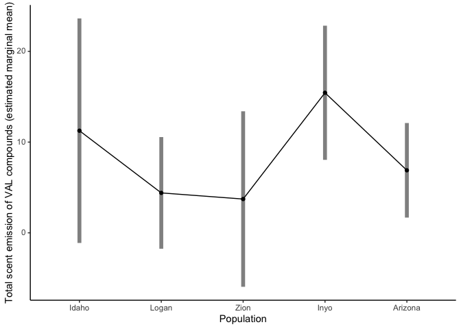<!-- -->

*Interpretation*: No differences across populations.

**LIN group**:

Diagnostics for the model residuals:
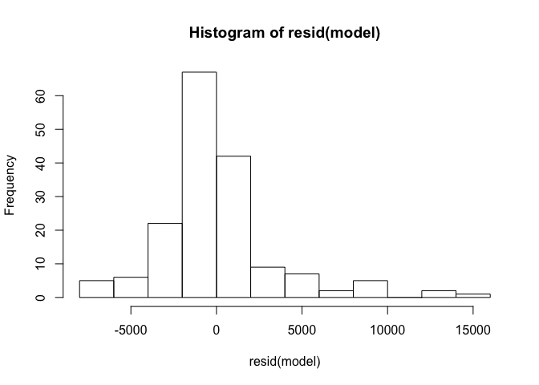<!-- -->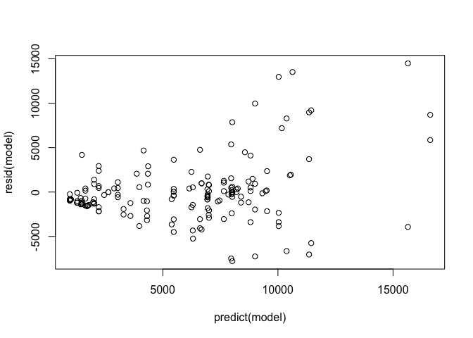<!-- -->

Untransformed residuals look okay, square root transformation (not
shown) is comparable and doesn’t affect the results.

Model
    summary:

    ## Linear mixed model fit by REML. t-tests use Satterthwaite's method [
    ## lmerModLmerTest]
    ## Formula: G.LIN ~ Population + (1 | Pop_Plant)
    ##    Data: ER_f_mass_groups
    ## 
    ## REML criterion at convergence: 3235.6
    ## 
    ## Scaled residuals: 
    ##     Min      1Q  Median      3Q     Max 
    ## -1.9556 -0.3689 -0.1093  0.2015  3.6416 
    ## 
    ## Random effects:
    ##  Groups    Name        Variance Std.Dev.
    ##  Pop_Plant (Intercept)  9355167 3059    
    ##  Residual              15835932 3979    
    ## Number of obs: 168, groups:  Pop_Plant, 77
    ## 
    ## Fixed effects:
    ##                   Estimate Std. Error      df t value Pr(>|t|)   
    ## (Intercept)        1989.41    1885.59   50.25   1.055  0.29645   
    ## PopulationLogan     657.51    2109.60   51.40   0.312  0.75655   
    ## PopulationZion     3929.64    2425.02   60.03   1.620  0.11038   
    ## PopulationInyo     7418.33    2210.87   54.81   3.355  0.00144 **
    ## PopulationArizona  6030.42    2043.30   49.54   2.951  0.00482 **
    ## ---
    ## Signif. codes:  0 '***' 0.001 '**' 0.01 '*' 0.05 '.' 0.1 ' ' 1
    ## 
    ## Correlation of Fixed Effects:
    ##             (Intr) PpltnL PpltnZ PpltnI
    ## PopulatnLgn -0.894                     
    ## PopulatinZn -0.778  0.695              
    ## PopulatnIny -0.853  0.762  0.663       
    ## PopultnArzn -0.923  0.825  0.718  0.787

ANOVA:

    ## Type III Analysis of Variance Table with Satterthwaite's method
    ##               Sum Sq   Mean Sq NumDF  DenDF F value    Pr(>F)    
    ## Population 509797610 127449403     4 59.245  8.0481 2.985e-05 ***
    ## ---
    ## Signif. codes:  0 '***' 0.001 '**' 0.01 '*' 0.05 '.' 0.1 ' ' 1

Estimated marginal means & contrasts across populations:

    ## $emmeans
    ##  Population emmean   SE   df lower.CL upper.CL
    ##  Idaho        1989 1895 60.4    -1800     5779
    ##  Logan        2647  950 67.0      750     4544
    ##  Zion         5919 1527 91.0     2886     8952
    ##  Inyo         9408 1157 81.0     7106    11710
    ##  Arizona      8020  790 55.4     6437     9602
    ## 
    ## Degrees-of-freedom method: kenward-roger 
    ## Confidence level used: 0.95 
    ## 
    ## $contrasts
    ##  contrast        estimate   SE   df t.ratio p.value
    ##  Idaho - Logan       -658 2120 61.7 -0.310  0.9979 
    ##  Idaho - Zion       -3930 2433 70.9 -1.615  0.4930 
    ##  Idaho - Inyo       -7418 2220 65.4 -3.342  0.0117 
    ##  Idaho - Arizona    -6030 2053 59.6 -2.938  0.0364 
    ##  Logan - Zion       -3272 1798 83.6 -1.820  0.3694 
    ##  Logan - Inyo       -6761 1497 75.0 -4.516  0.0002 
    ##  Logan - Arizona    -5373 1236 61.9 -4.349  0.0005 
    ##  Zion - Inyo        -3489 1916 87.2 -1.821  0.3682 
    ##  Zion - Arizona     -2101 1719 81.9 -1.222  0.7386 
    ##  Inyo - Arizona      1388 1401 71.6  0.991  0.8586 
    ## 
    ## Degrees-of-freedom method: kenward-roger 
    ## P value adjustment: tukey method for comparing a family of 5 estimates

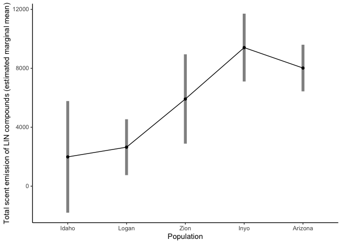<!-- -->

*Interpretation*: Inyo and Arizona emit more LIN compounds than Idaho or
Logan. Zion is intermediate.

**For data exploration purposes**: These are the analyses of the non-key
compound groups, e.g., the groups that were *not* correlated with CAP1
and/or CAP2.

**PHE group**:

Diagnostics for the model residuals:
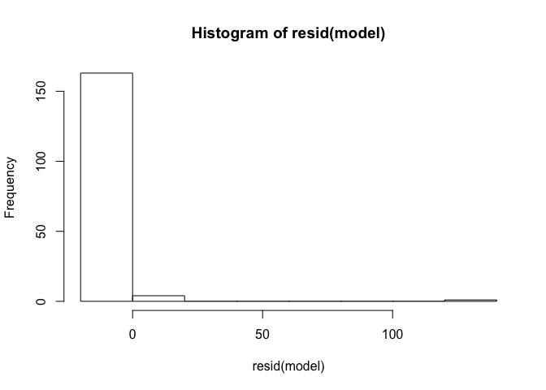<!-- -->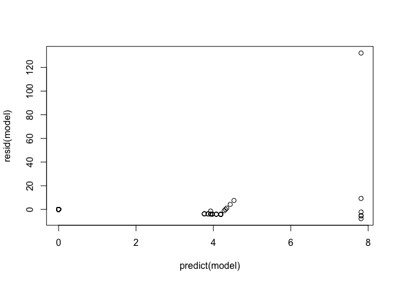<!-- -->

Model
    summary:

    ## Linear mixed model fit by REML. t-tests use Satterthwaite's method [
    ## lmerModLmerTest]
    ## Formula: G.PHE ~ Population + (1 | Pop_Plant)
    ##    Data: ER_f_mass_groups
    ## 
    ## REML criterion at convergence: 1256.7
    ## 
    ## Scaled residuals: 
    ##    Min     1Q Median     3Q    Max 
    ## -0.729  0.000  0.000  0.000 12.324 
    ## 
    ## Random effects:
    ##  Groups    Name        Variance Std.Dev.
    ##  Pop_Plant (Intercept)   3.341   1.828  
    ##  Residual              115.002  10.724  
    ## Number of obs: 168, groups:  Pop_Plant, 77
    ## 
    ## Fixed effects:
    ##                     Estimate Std. Error         df t value Pr(>|t|)
    ## (Intercept)       -1.432e-16  3.157e+00  6.397e+01   0.000    1.000
    ## PopulationLogan    4.313e+00  3.572e+00  6.938e+01   1.207    0.231
    ## PopulationZion     3.078e-16  4.385e+00  1.008e+02   0.000    1.000
    ## PopulationInyo     4.586e-16  3.853e+00  8.227e+01   0.000    1.000
    ## PopulationArizona  3.078e-16  3.425e+00  6.617e+01   0.000    1.000
    ## 
    ## Correlation of Fixed Effects:
    ##             (Intr) PpltnL PpltnZ PpltnI
    ## PopulatnLgn -0.884                     
    ## PopulatinZn -0.720  0.636              
    ## PopulatnIny -0.819  0.724  0.590       
    ## PopultnArzn -0.922  0.815  0.664  0.755

ANOVA:

    ## Type III Analysis of Variance Table with Satterthwaite's method
    ##            Sum Sq Mean Sq NumDF  DenDF F value Pr(>F)
    ## Population 561.04  140.26     4 97.092  1.2196 0.3075

Estimated marginal means & contrasts across populations:

    ## $emmeans
    ##  Population emmean   SE    df lower.CL upper.CL
    ##  Idaho        0.00 3.27  26.2   -6.717     6.72
    ##  Logan        4.31 1.70  46.1    0.894     7.73
    ##  Zion         0.00 3.05 126.7   -6.031     6.03
    ##  Inyo         0.00 2.22  92.9   -4.414     4.41
    ##  Arizona      0.00 1.35  36.4   -2.739     2.74
    ## 
    ## Degrees-of-freedom method: kenward-roger 
    ## Confidence level used: 0.95 
    ## 
    ## $contrasts
    ##  contrast        estimate   SE    df t.ratio p.value
    ##  Idaho - Logan      -4.31 3.68  29.4 -1.171  0.7676 
    ##  Idaho - Zion        0.00 4.47  52.9  0.000  1.0000 
    ##  Idaho - Inyo        0.00 3.95  37.8  0.000  1.0000 
    ##  Idaho - Arizona     0.00 3.54  27.4  0.000  1.0000 
    ##  Logan - Zion        4.31 3.49 101.3  1.236  0.7304 
    ##  Logan - Inyo        4.31 2.80  71.4  1.542  0.5393 
    ##  Logan - Arizona     4.31 2.17  42.0  1.987  0.2898 
    ##  Zion - Inyo         0.00 3.77 114.5  0.000  1.0000 
    ##  Zion - Arizona      0.00 3.33 104.5  0.000  1.0000 
    ##  Inyo - Arizona      0.00 2.60  71.4  0.000  1.0000 
    ## 
    ## Degrees-of-freedom method: kenward-roger 
    ## P value adjustment: tukey method for comparing a family of 5 estimates

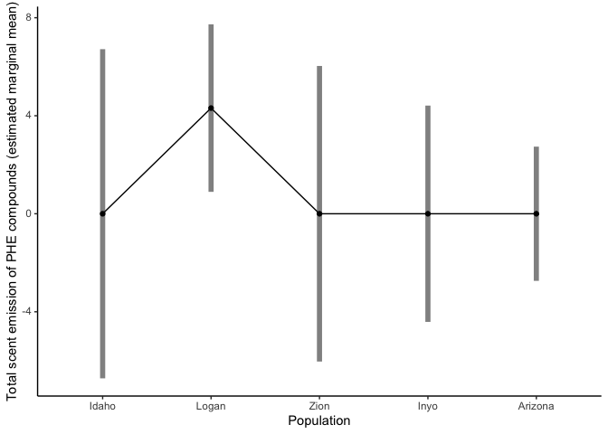<!-- -->

*Interpretation*: Differences can’t really be estimated properly due to
the lack of data; these compounds are only produced in Logan.

**OCI group**:

Diagnostics for the model residuals:
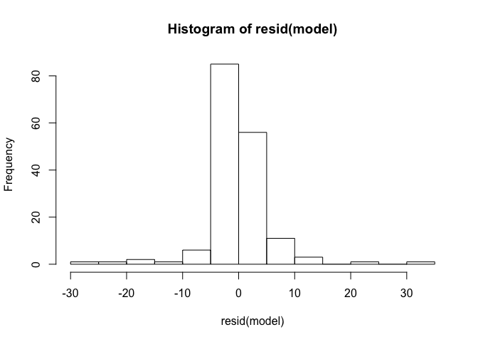<!-- -->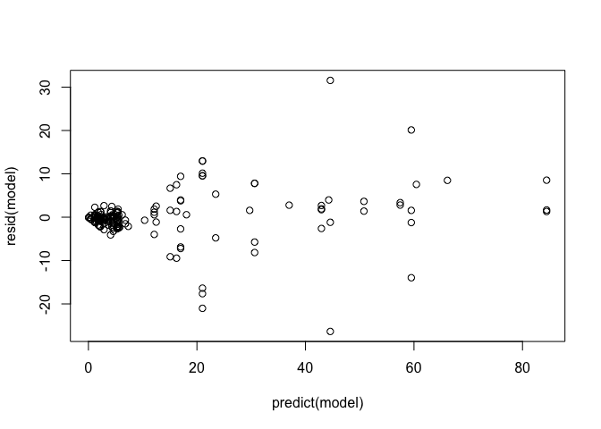<!-- -->

Square-root transformation applied to improve residuals.

Model
    summary:

    ## Linear mixed model fit by REML. t-tests use Satterthwaite's method [
    ## lmerModLmerTest]
    ## Formula: sqrt(G.OCI) ~ Population + (1 | Pop_Plant)
    ##    Data: ER_f_mass_groups
    ## 
    ## REML criterion at convergence: 1305.7
    ## 
    ## Scaled residuals: 
    ##     Min      1Q  Median      3Q     Max 
    ## -3.6026 -0.2075 -0.0274  0.1715  4.3137 
    ## 
    ## Random effects:
    ##  Groups    Name        Variance Std.Dev.
    ##  Pop_Plant (Intercept) 324.26   18.007  
    ##  Residual               53.52    7.316  
    ## Number of obs: 168, groups:  Pop_Plant, 77
    ## 
    ## Fixed effects:
    ##                   Estimate Std. Error      df t value Pr(>|t|)  
    ## (Intercept)         0.7432     8.4501 72.0670   0.088    0.930  
    ## PopulationLogan    13.9047     9.4123 72.3606   1.477    0.144  
    ## PopulationZion      3.1203    10.5832 73.3258   0.295    0.769  
    ## PopulationInyo      2.0881     9.7782 72.7043   0.214    0.832  
    ## PopulationArizona  19.4294     9.1911 71.8130   2.114    0.038 *
    ## ---
    ## Signif. codes:  0 '***' 0.001 '**' 0.01 '*' 0.05 '.' 0.1 ' ' 1
    ## 
    ## Correlation of Fixed Effects:
    ##             (Intr) PpltnL PpltnZ PpltnI
    ## PopulatnLgn -0.898                     
    ## PopulatinZn -0.798  0.717              
    ## PopulatnIny -0.864  0.776  0.690       
    ## PopultnArzn -0.919  0.825  0.734  0.795

ANOVA:

    ## Type III Analysis of Variance Table with Satterthwaite's method
    ##            Sum Sq Mean Sq NumDF  DenDF F value Pr(>F)  
    ## Population 662.93  165.73     4 73.351  3.0967 0.0206 *
    ## ---
    ## Signif. codes:  0 '***' 0.001 '**' 0.01 '*' 0.05 '.' 0.1 ' ' 1

Estimated marginal means & contrasts across populations:

    ## $emmeans
    ##  Population response    SE   df lower.CL upper.CL
    ##  Idaho         0.552  12.6 71.1      0.0      310
    ##  Logan       214.563 121.5 72.6     40.7      525
    ##  Zion         14.927  49.2 74.6      0.0      274
    ##  Inyo          8.016  27.9 73.7      0.0      160
    ##  Arizona     406.933 145.9 69.5    168.0      750
    ## 
    ## Degrees-of-freedom method: kenward-roger 
    ## Confidence level used: 0.95 
    ## Intervals are back-transformed from the sqrt scale 
    ## 
    ## $contrasts
    ##  contrast        estimate    SE   df t.ratio p.value
    ##  Idaho - Logan     -13.90  9.41 71.4 -1.477  0.5805 
    ##  Idaho - Zion       -3.12 10.58 72.4 -0.295  0.9983 
    ##  Idaho - Inyo       -2.09  9.78 71.8 -0.214  0.9995 
    ##  Idaho - Arizona   -19.43  9.19 70.9 -2.114  0.2258 
    ##  Logan - Zion       10.78  7.60 74.0  1.419  0.6178 
    ##  Logan - Inyo       11.82  6.43 73.2  1.836  0.3610 
    ##  Logan - Arizona    -5.52  5.50 71.3 -1.004  0.8526 
    ##  Zion - Inyo         1.03  8.05 74.3  0.128  0.9999 
    ##  Zion - Arizona    -16.31  7.33 73.3 -2.226  0.1818 
    ##  Inyo - Arizona    -17.34  6.11 72.2 -2.840  0.0449 
    ## 
    ## Note: contrasts are still on the sqrt scale 
    ## Degrees-of-freedom method: kenward-roger 
    ## P value adjustment: tukey method for comparing a family of 5 estimates

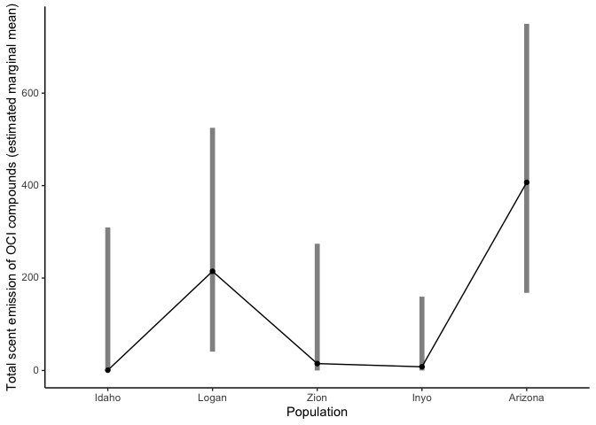<!-- -->

*Interpretation*: Arizona has higher emission rates of OCI compounds
than Inyo. These compounds are only produced in sizeable volumes in
Arizona and Logan (see estimated marginal means above.)

**GER group**:

Diagnostics for the model residuals:
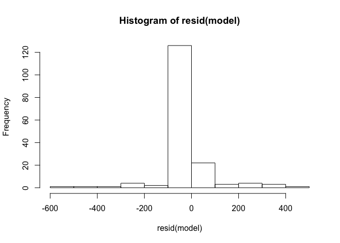<!-- -->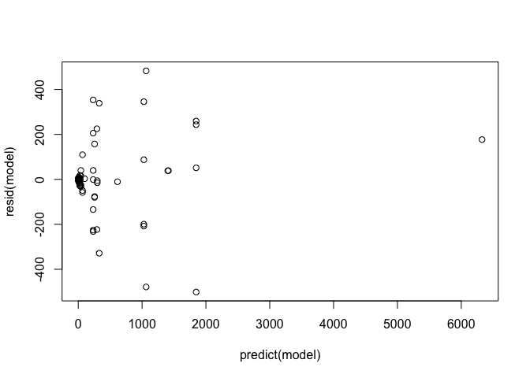<!-- -->

Model
    summary:

    ## Linear mixed model fit by REML. t-tests use Satterthwaite's method [
    ## lmerModLmerTest]
    ## Formula: G.GER ~ Population + (1 | Pop_Plant)
    ##    Data: ER_f_mass_groups
    ## 
    ## REML criterion at convergence: 2374
    ## 
    ## Scaled residuals: 
    ##     Min      1Q  Median      3Q     Max 
    ## -3.6286 -0.0274 -0.0069 -0.0014  3.4946 
    ## 
    ## Random effects:
    ##  Groups    Name        Variance Std.Dev.
    ##  Pop_Plant (Intercept) 581244   762.4   
    ##  Residual               19085   138.1   
    ## Number of obs: 168, groups:  Pop_Plant, 77
    ## 
    ## Fixed effects:
    ##                   Estimate Std. Error     df t value Pr(>|t|)  
    ## (Intercept)          59.10     344.43  70.70   0.172   0.8643  
    ## PopulationLogan     -47.21     383.34  70.77  -0.123   0.9023  
    ## PopulationZion      877.99     429.96  70.95   2.042   0.0449 *
    ## PopulationInyo      -33.78     397.90  70.83  -0.085   0.9326  
    ## PopulationArizona   175.40     374.90  70.65   0.468   0.6413  
    ## ---
    ## Signif. codes:  0 '***' 0.001 '**' 0.01 '*' 0.05 '.' 0.1 ' ' 1
    ## 
    ## Correlation of Fixed Effects:
    ##             (Intr) PpltnL PpltnZ PpltnI
    ## PopulatnLgn -0.899                     
    ## PopulatinZn -0.801  0.720              
    ## PopulatnIny -0.866  0.778  0.693       
    ## PopultnArzn -0.919  0.825  0.736  0.795

ANOVA:

    ## Type III Analysis of Variance Table with Satterthwaite's method
    ##            Sum Sq Mean Sq NumDF  DenDF F value  Pr(>F)  
    ## Population 199286   49822     4 70.966  2.6105 0.04256 *
    ## ---
    ## Signif. codes:  0 '***' 0.001 '**' 0.01 '*' 0.05 '.' 0.1 ' ' 1

Estimated marginal means & contrasts across populations:

    ## $emmeans
    ##  Population emmean  SE   df lower.CL upper.CL
    ##  Idaho        59.1 344 71.8   -627.5      746
    ##  Logan        11.9 168 72.2   -323.5      347
    ##  Zion        937.1 257 72.5    424.1     1450
    ##  Inyo         25.3 199 72.4   -371.8      422
    ##  Arizona     234.5 148 71.5    -60.6      530
    ## 
    ## Degrees-of-freedom method: kenward-roger 
    ## Confidence level used: 0.95 
    ## 
    ## $contrasts
    ##  contrast        estimate  SE   df t.ratio p.value
    ##  Idaho - Logan       47.2 383 71.9  0.123  0.9999 
    ##  Idaho - Zion      -878.0 430 72.1 -2.042  0.2569 
    ##  Idaho - Inyo        33.8 398 72.0  0.085  1.0000 
    ##  Idaho - Arizona   -175.4 375 71.8 -0.468  0.9900 
    ##  Logan - Zion      -925.2 307 72.4 -3.009  0.0288 
    ##  Logan - Inyo       -13.4 261 72.3 -0.052  1.0000 
    ##  Logan - Arizona   -222.6 224 71.9 -0.993  0.8575 
    ##  Zion - Inyo        911.8 325 72.5  2.802  0.0495 
    ##  Zion - Arizona     702.6 297 72.3  2.366  0.1365 
    ##  Inyo - Arizona    -209.2 248 72.0 -0.843  0.9163 
    ## 
    ## Degrees-of-freedom method: kenward-roger 
    ## P value adjustment: tukey method for comparing a family of 5 estimates

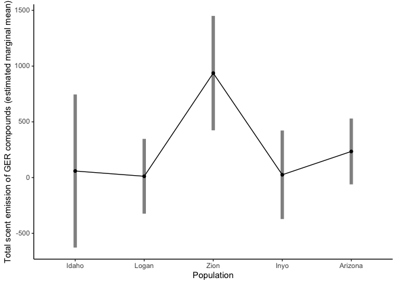<!-- -->

*Interpretation*: Zion has higher emission rates of GER compounds than
Logan, and Zion is marginally higher than Inyo.

**CAR group**:

Diagnostics for the model residuals:
<!-- -->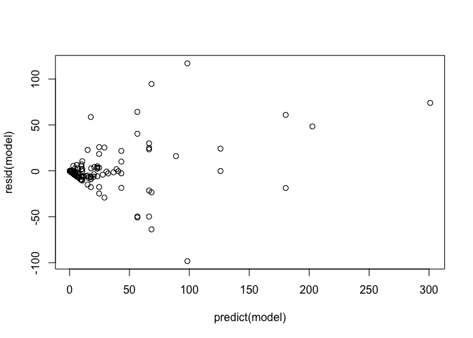<!-- -->

Model
    summary:

    ## Linear mixed model fit by REML. t-tests use Satterthwaite's method [
    ## lmerModLmerTest]
    ## Formula: G.CAR ~ Population + (1 | Pop_Plant)
    ##    Data: ER_f_mass_groups
    ## 
    ## REML criterion at convergence: 1701.7
    ## 
    ## Scaled residuals: 
    ##     Min      1Q  Median      3Q     Max 
    ## -3.5864 -0.1935 -0.0475 -0.0081  4.2689 
    ## 
    ## Random effects:
    ##  Groups    Name        Variance Std.Dev.
    ##  Pop_Plant (Intercept) 2629.8   51.28   
    ##  Residual               751.8   27.42   
    ## Number of obs: 168, groups:  Pop_Plant, 77
    ## 
    ## Fixed effects:
    ##                   Estimate Std. Error     df t value Pr(>|t|)
    ## (Intercept)          4.554     24.828 63.127   0.183    0.855
    ## PopulationLogan     37.701     27.673 63.566   1.362    0.178
    ## PopulationZion      28.918     31.183 65.213   0.927    0.357
    ## PopulationInyo      28.320     28.772 64.169   0.984    0.329
    ## PopulationArizona    1.847     26.991 62.739   0.068    0.946
    ## 
    ## Correlation of Fixed Effects:
    ##             (Intr) PpltnL PpltnZ PpltnI
    ## PopulatnLgn -0.897                     
    ## PopulatinZn -0.796  0.714              
    ## PopulatnIny -0.863  0.774  0.687       
    ## PopultnArzn -0.920  0.825  0.732  0.794

ANOVA:

    ## Type III Analysis of Variance Table with Satterthwaite's method
    ##            Sum Sq Mean Sq NumDF  DenDF F value Pr(>F)
    ## Population 4686.1  1171.5     4 65.211  1.5583  0.196

Estimated marginal means & contrasts across populations:

    ## $emmeans
    ##  Population emmean   SE   df lower.CL upper.CL
    ##  Idaho        4.55 24.8 70.4   -44.98     54.1
    ##  Logan       42.25 12.2 72.7    17.89     66.6
    ##  Zion        33.47 18.9 76.4    -4.11     71.1
    ##  Inyo        32.87 14.5 74.7     3.90     61.8
    ##  Arizona      6.40 10.6 67.8   -14.73     27.5
    ## 
    ## Degrees-of-freedom method: kenward-roger 
    ## Confidence level used: 0.95 
    ## 
    ## $contrasts
    ##  contrast        estimate   SE   df t.ratio p.value
    ##  Idaho - Logan    -37.701 27.7 70.8 -1.362  0.6537 
    ##  Idaho - Zion     -28.918 31.2 72.5 -0.927  0.8855 
    ##  Idaho - Inyo     -28.320 28.8 71.4 -0.984  0.8616 
    ##  Idaho - Arizona   -1.847 27.0 70.0 -0.068  1.0000 
    ##  Logan - Zion       8.783 22.5 75.3  0.391  0.9950 
    ##  Logan - Inyo       9.381 19.0 73.9  0.494  0.9877 
    ##  Logan - Arizona   35.854 16.2 70.6  2.217  0.1855 
    ##  Zion - Inyo        0.598 23.8 75.8  0.025  1.0000 
    ##  Zion - Arizona    27.071 21.6 74.2  1.251  0.7215 
    ##  Inyo - Arizona    26.473 18.0 72.2  1.472  0.5840 
    ## 
    ## Degrees-of-freedom method: kenward-roger 
    ## P value adjustment: tukey method for comparing a family of 5 estimates

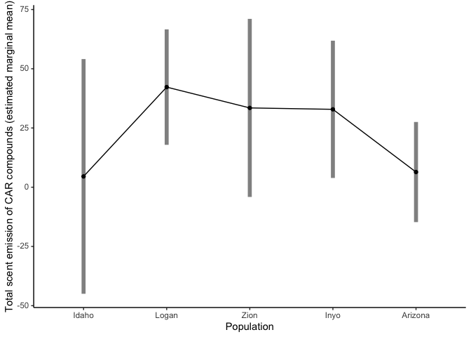<!-- -->

*Interpretation*: The populations do not differ in the amount of CAR
compounds emitted.

**SES group**:

Diagnostics for the model residuals:
<!-- --><!-- -->

Untransformed residuals look okay, square root transformation (not
shown) is comparable and doesn’t affect the results.

Model
    summary:

    ## Linear mixed model fit by REML. t-tests use Satterthwaite's method [
    ## lmerModLmerTest]
    ## Formula: G.SES ~ Population + (1 | Pop_Plant)
    ##    Data: ER_f_mass_groups
    ## 
    ## REML criterion at convergence: 2811.6
    ## 
    ## Scaled residuals: 
    ##     Min      1Q  Median      3Q     Max 
    ## -5.3586 -0.1347 -0.0075  0.0032  5.2888 
    ## 
    ## Random effects:
    ##  Groups    Name        Variance Std.Dev.
    ##  Pop_Plant (Intercept) 2115879  1454.6  
    ##  Residual               729697   854.2  
    ## Number of obs: 168, groups:  Pop_Plant, 77
    ## 
    ## Fixed effects:
    ##                   Estimate Std. Error       df t value Pr(>|t|)  
    ## (Intercept)         64.304    714.379   71.112   0.090   0.9285  
    ## PopulationLogan   1363.192    796.445   71.634   1.712   0.0913 .
    ## PopulationZion       1.073    898.395   73.702   0.001   0.9991  
    ## PopulationInyo     826.893    828.379   72.399   0.998   0.3215  
    ## PopulationArizona  -49.431    776.404   70.647  -0.064   0.9494  
    ## ---
    ## Signif. codes:  0 '***' 0.001 '**' 0.01 '*' 0.05 '.' 0.1 ' ' 1
    ## 
    ## Correlation of Fixed Effects:
    ##             (Intr) PpltnL PpltnZ PpltnI
    ## PopulatnLgn -0.897                     
    ## PopulatinZn -0.795  0.713              
    ## PopulatnIny -0.862  0.774  0.686       
    ## PopultnArzn -0.920  0.825  0.732  0.793

ANOVA:

    ## Type III Analysis of Variance Table with Satterthwaite's method
    ##             Sum Sq Mean Sq NumDF  DenDF F value  Pr(>F)  
    ## Population 8179119 2044780     4 73.677  2.8022 0.03181 *
    ## ---
    ## Signif. codes:  0 '***' 0.001 '**' 0.01 '*' 0.05 '.' 0.1 ' ' 1

Estimated marginal means & contrasts across populations:

    ## $emmeans
    ##  Population emmean  SE   df lower.CL upper.CL
    ##  Idaho        64.3 715 70.0  -1361.2     1490
    ##  Logan      1427.5 352 72.7    725.3     2130
    ##  Zion         65.4 545 77.2  -1019.6     1150
    ##  Inyo        891.2 420 75.1     55.5     1727
    ##  Arizona      14.9 304 67.0   -592.3      622
    ## 
    ## Degrees-of-freedom method: kenward-roger 
    ## Confidence level used: 0.95 
    ## 
    ## $contrasts
    ##  contrast        estimate  SE   df t.ratio p.value
    ##  Idaho - Logan   -1363.19 797 70.5 -1.711  0.4341 
    ##  Idaho - Zion       -1.07 899 72.5 -0.001  1.0000 
    ##  Idaho - Inyo     -826.89 829 71.2 -0.998  0.8555 
    ##  Idaho - Arizona    49.43 777 69.5  0.064  1.0000 
    ##  Logan - Zion     1362.12 649 75.8  2.099  0.2311 
    ##  Logan - Inyo      536.30 548 74.1  0.979  0.8639 
    ##  Logan - Arizona  1412.62 465 70.2  3.035  0.0270 
    ##  Zion - Inyo      -825.82 688 76.4 -1.201  0.7508 
    ##  Zion - Arizona     50.50 624 74.7  0.081  1.0000 
    ##  Inyo - Arizona    876.32 518 72.2  1.691  0.4458 
    ## 
    ## Degrees-of-freedom method: kenward-roger 
    ## P value adjustment: tukey method for comparing a family of 5 estimates

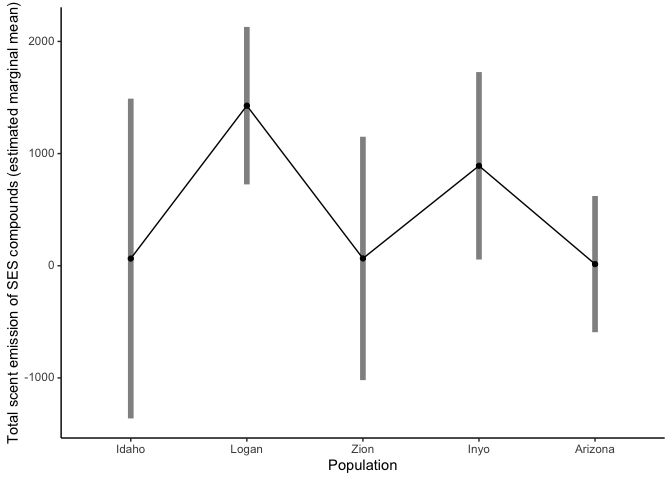<!-- -->

*Interpretation*: Logan has higher SES emissions than Arizona. All other
contrasts are non-significant.

### Floral morphology, multivariate analyses

In order to do multivariate analyses of the morphological variables, I
had to drop leaf number and leaf length, because there isn’t enough
data.

    ## 
    ## Call:
    ## adonis(formula = morph_data ~ Population, data = morph_names,      permutations = 999, method = "bray") 
    ## 
    ## Permutation: free
    ## Number of permutations: 999
    ## 
    ## Terms added sequentially (first to last)
    ## 
    ##             Df SumsOfSqs  MeanSqs F.Model      R2 Pr(>F)    
    ## Population   4   0.78747 0.196867   23.18 0.44001  0.001 ***
    ## Residuals  118   1.00219 0.008493         0.55999           
    ## Total      122   1.78966                  1.00000           
    ## ---
    ## Signif. codes:  0 '***' 0.001 '**' 0.01 '*' 0.05 '.' 0.1 ' ' 1

*Interpretation*: There is a significant effect of Population. It
explains about 44 % of the variation in morphology.

Running a constrained analysis of principle coordinates:

    ## 
    ## Call:
    ## capscale(formula = morph_data ~ Population, data = morph_names,      distance = "bray") 
    ## 
    ## Partitioning of squared Bray distance:
    ##               Inertia Proportion
    ## Total          2.2714     1.0000
    ## Constrained    0.8025     0.3533
    ## Unconstrained  1.4689     0.6467
    ## 
    ## Eigenvalues, and their contribution to the squared Bray distance 
    ## 
    ## Importance of components:
    ##                         CAP1    CAP2     CAP3     CAP4   MDS1    MDS2    MDS3
    ## Eigenvalue            0.6777 0.10755 0.011998 0.005265 0.5122 0.15690 0.12982
    ## Proportion Explained  0.2984 0.04735 0.005282 0.002318 0.2255 0.06908 0.05715
    ## Cumulative Proportion 0.2984 0.34571 0.350996 0.353313 0.5788 0.64790 0.70505
    ##                          MDS4    MDS5    MDS6    MDS7    MDS8    MDS9   MDS10
    ## Eigenvalue            0.10934 0.07594 0.06994 0.05323 0.04606 0.04209 0.03161
    ## Proportion Explained  0.04814 0.03343 0.03079 0.02344 0.02028 0.01853 0.01392
    ## Cumulative Proportion 0.75319 0.78662 0.81741 0.84085 0.86113 0.87966 0.89357
    ##                         MDS11   MDS12    MDS13    MDS14   MDS15   MDS16
    ## Eigenvalue            0.02531 0.02302 0.021945 0.019257 0.01669 0.01351
    ## Proportion Explained  0.01114 0.01014 0.009661 0.008478 0.00735 0.00595
    ## Cumulative Proportion 0.90472 0.91485 0.924516 0.932994 0.94034 0.94629
    ##                          MDS17    MDS18    MDS19    MDS20    MDS21    MDS22
    ## Eigenvalue            0.013243 0.012687 0.009918 0.009550 0.008693 0.007835
    ## Proportion Explained  0.005831 0.005585 0.004366 0.004205 0.003827 0.003450
    ## Cumulative Proportion 0.952125 0.957710 0.962076 0.966281 0.970108 0.973558
    ##                          MDS23    MDS24    MDS25    MDS26    MDS27    MDS28
    ## Eigenvalue            0.007430 0.006422 0.005963 0.004885 0.004453 0.004065
    ## Proportion Explained  0.003271 0.002827 0.002625 0.002150 0.001960 0.001790
    ## Cumulative Proportion 0.976829 0.979656 0.982282 0.984432 0.986393 0.988182
    ##                          MDS29    MDS30    MDS31    MDS32     MDS33     MDS34
    ## Eigenvalue            0.003542 0.003202 0.002971 0.002800 0.0021433 0.0020780
    ## Proportion Explained  0.001559 0.001410 0.001308 0.001233 0.0009436 0.0009149
    ## Cumulative Proportion 0.989742 0.991152 0.992459 0.993692 0.9946357 0.9955506
    ##                           MDS35     MDS36     MDS37    MDS38     MDS39
    ## Eigenvalue            0.0017288 0.0016244 0.0014017 0.001102 0.0010052
    ## Proportion Explained  0.0007611 0.0007152 0.0006171 0.000485 0.0004425
    ## Cumulative Proportion 0.9963117 0.9970269 0.9976440 0.998129 0.9985715
    ##                           MDS40     MDS41     MDS42     MDS43     MDS44
    ## Eigenvalue            0.0009934 0.0006336 0.0005341 0.0004513 0.0003146
    ## Proportion Explained  0.0004373 0.0002789 0.0002352 0.0001987 0.0001385
    ## Cumulative Proportion 0.9990088 0.9992877 0.9995229 0.9997216 0.9998601
    ##                           MDS45     MDS46     MDS47
    ## Eigenvalue            2.166e-04 9.861e-05 2.647e-06
    ## Proportion Explained  9.535e-05 4.341e-05 1.165e-06
    ## Cumulative Proportion 1.000e+00 1.000e+00 1.000e+00
    ## 
    ## Accumulated constrained eigenvalues
    ## Importance of components:
    ##                         CAP1   CAP2    CAP3     CAP4
    ## Eigenvalue            0.6777 0.1076 0.01200 0.005265
    ## Proportion Explained  0.8445 0.1340 0.01495 0.006560
    ## Cumulative Proportion 0.8445 0.9785 0.99344 1.000000
    ## 
    ## Scaling 2 for species and site scores
    ## * Species are scaled proportional to eigenvalues
    ## * Sites are unscaled: weighted dispersion equal on all dimensions
    ## * General scaling constant of scores:

The constrained portion explains about 35% of overall distance. CAP1
explains about 29% and CAP2 expalins about 5% of overall distance.

Plotting the capscale:
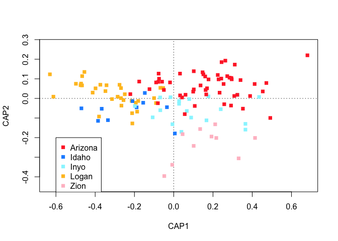<!-- -->

Checking to see which compound group(s) are significantly correlated
with CAP1 and/or
CAP2.

| variables            | cor1     |     p1 | cor2     |     p2 | sig1 | sig2 |
| :------------------- | :------- | -----: | :------- | -----: | :--- | :--- |
| M.Corolla\_D1        | 0.4729   | 0.0000 | \-0.3562 | 0.0001 | Yes  | Yes  |
| M.Corolla\_D2        | 0.6348   | 0.0000 | \-0.6315 | 0.0000 | Yes  | Yes  |
| M.Tube\_Flare        | 0.4552   | 0.0000 | \-0.418  | 0.0000 | Yes  | Yes  |
| M.Stamen\_Length     | 0.5212   | 0.0000 | \-0.5768 | 0.0000 | Yes  | Yes  |
| M.Style\_Length      | 0.3368   | 0.0002 | \-0.6922 | 0.0000 | Yes  | Yes  |
| M.Hypanthium\_Length | 0.7619   | 0.0000 | 0.1372   | 0.1303 | Yes  | No   |
| M.Pedicel\_Length    | \-0.4001 | 0.0000 | \-0.2798 | 0.0026 | Yes  | Yes  |
| M.Nectar\_Column     | 0.8358   | 0.0000 | 0.2068   | 0.0244 | Yes  | No   |
| M.Percent\_Sugar     | 0.0515   | 0.5716 | \-0.273  | 0.0029 | No   | Yes  |

From this, all variables except for percent sugar are correlated with
CAP1, and all of them are positively correlated except for pedicel
length.

All variables except Hypanthium length and nectar column are correlated
with CAP2. All of these correlations are negative.

### Floral morphology, univariate analyses

Looking at all nine floral morphology variables, as all were correlated
with CAP1 and/or CAP2. Each variable is modeled as a function of
population, with plant nested within population as a random effect. This
uses data from all measured flowers where all variables were measured on
the flower.

**Corolla D1**:

Diagnostics for the model residuals:
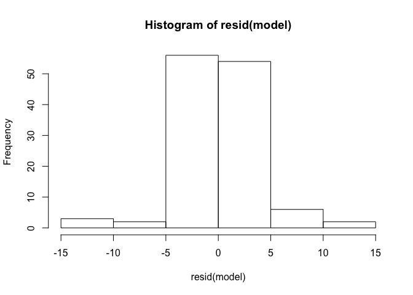<!-- -->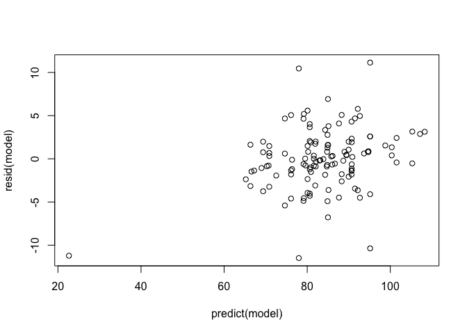<!-- -->

Model
    summary:

    ## Linear mixed model fit by REML. t-tests use Satterthwaite's method [
    ## lmerModLmerTest]
    ## Formula: M.Corolla_D1 ~ Population + (1 | Pop_Plant)
    ##    Data: morph_names
    ## 
    ## REML criterion at convergence: 870.6
    ## 
    ## Scaled residuals: 
    ##      Min       1Q   Median       3Q      Max 
    ## -2.34337 -0.33664  0.00126  0.39074  2.27238 
    ## 
    ## Random effects:
    ##  Groups    Name        Variance Std.Dev.
    ##  Pop_Plant (Intercept) 143.45   11.977  
    ##  Residual               24.04    4.903  
    ## Number of obs: 123, groups:  Pop_Plant, 67
    ## 
    ## Fixed effects:
    ##                   Estimate Std. Error     df t value Pr(>|t|)    
    ## (Intercept)         79.377      6.305 57.105  12.589   <2e-16 ***
    ## PopulationLogan     -3.986      7.010 57.211  -0.569    0.572    
    ## PopulationZion      10.214      7.765 58.548   1.315    0.194    
    ## PopulationInyo      10.625      7.228 57.743   1.470    0.147    
    ## PopulationArizona    4.742      6.789 57.052   0.698    0.488    
    ## ---
    ## Signif. codes:  0 '***' 0.001 '**' 0.01 '*' 0.05 '.' 0.1 ' ' 1
    ## 
    ## Correlation of Fixed Effects:
    ##             (Intr) PpltnL PpltnZ PpltnI
    ## PopulatnLgn -0.899                     
    ## PopulatinZn -0.812  0.730              
    ## PopulatnIny -0.872  0.785  0.708       
    ## PopultnArzn -0.929  0.835  0.754  0.810

ANOVA:

    ## Type III Analysis of Variance Table with Satterthwaite's method
    ##            Sum Sq Mean Sq NumDF  DenDF F value  Pr(>F)  
    ## Population 304.72   76.18     4 58.617  3.1691 0.02001 *
    ## ---
    ## Signif. codes:  0 '***' 0.001 '**' 0.01 '*' 0.05 '.' 0.1 ' ' 1

Estimated marginal means & contrasts across populations:

    ## $emmeans
    ##  Population emmean   SE   df lower.CL upper.CL
    ##  Idaho        79.4 6.31 60.9     66.8     92.0
    ##  Logan        75.4 3.06 61.4     69.3     81.5
    ##  Zion         89.6 4.53 65.2     80.5     98.6
    ##  Inyo         90.0 3.53 63.6     82.9     97.1
    ##  Arizona      84.1 2.52 60.5     79.1     89.2
    ## 
    ## Degrees-of-freedom method: kenward-roger 
    ## Confidence level used: 0.95 
    ## 
    ## $contrasts
    ##  contrast        estimate   SE   df t.ratio p.value
    ##  Idaho - Logan      3.986 7.01 61.0  0.568  0.9791 
    ##  Idaho - Zion     -10.214 7.77 62.3 -1.315  0.6829 
    ##  Idaho - Inyo     -10.625 7.23 61.5 -1.470  0.5857 
    ##  Idaho - Arizona   -4.742 6.79 60.8 -0.698  0.9561 
    ##  Logan - Zion     -14.199 5.47 64.0 -2.595  0.0833 
    ##  Logan - Inyo     -14.610 4.68 62.6 -3.123  0.0219 
    ##  Logan - Arizona   -8.728 3.97 61.0 -2.201  0.1934 
    ##  Zion - Inyo       -0.411 5.75 64.6 -0.072  1.0000 
    ##  Zion - Arizona     5.472 5.18 64.0  1.055  0.8284 
    ##  Inyo - Arizona     5.883 4.34 62.5  1.356  0.6577 
    ## 
    ## Degrees-of-freedom method: kenward-roger 
    ## P value adjustment: tukey method for comparing a family of 5 estimates

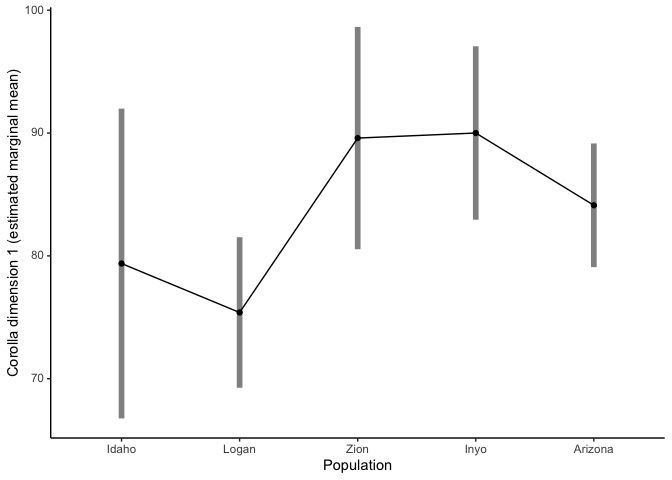<!-- -->

*Interpretation*: There is somewhat of a clinal pattern in corolla
dimension 1. The only significant contrast is that Logan is smaller than
Inyo.

**Corolla D2**:

Diagnostics for the model residuals:
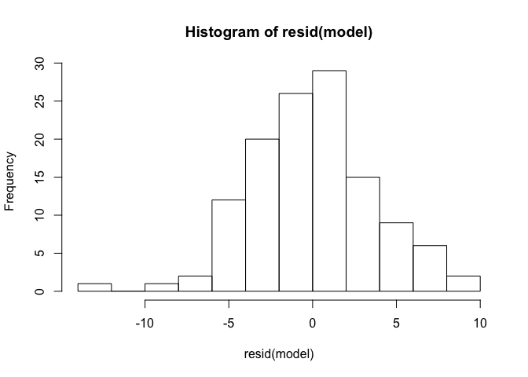<!-- -->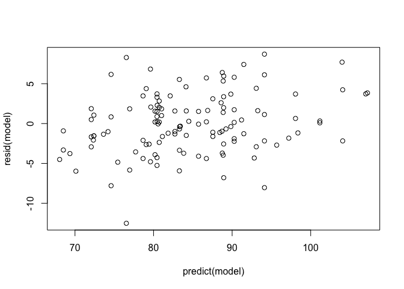<!-- -->

Model
    summary:

    ## Linear mixed model fit by REML. t-tests use Satterthwaite's method [
    ## lmerModLmerTest]
    ## Formula: M.Corolla_D2 ~ Population + (1 | Pop_Plant)
    ##    Data: morph_names
    ## 
    ## REML criterion at convergence: 804.4
    ## 
    ## Scaled residuals: 
    ##      Min       1Q   Median       3Q      Max 
    ## -2.59762 -0.47663 -0.00872  0.42545  1.80755 
    ## 
    ## Random effects:
    ##  Groups    Name        Variance Std.Dev.
    ##  Pop_Plant (Intercept) 40.91    6.396   
    ##  Residual              23.18    4.815   
    ## Number of obs: 123, groups:  Pop_Plant, 67
    ## 
    ## Fixed effects:
    ##                   Estimate Std. Error     df t value Pr(>|t|)    
    ## (Intercept)         80.656      3.712 54.347  21.730  < 2e-16 ***
    ## PopulationLogan     -4.659      4.131 54.846  -1.128   0.2643    
    ## PopulationZion      19.789      4.623 58.987   4.281 6.94e-05 ***
    ## PopulationInyo       9.753      4.277 56.465   2.281   0.0264 *  
    ## PopulationArizona    3.337      3.996 54.364   0.835   0.4073    
    ## ---
    ## Signif. codes:  0 '***' 0.001 '**' 0.01 '*' 0.05 '.' 0.1 ' ' 1
    ## 
    ## Correlation of Fixed Effects:
    ##             (Intr) PpltnL PpltnZ PpltnI
    ## PopulatnLgn -0.898                     
    ## PopulatinZn -0.803  0.721              
    ## PopulatnIny -0.868  0.780  0.697       
    ## PopultnArzn -0.929  0.835  0.746  0.806

ANOVA:

    ## Type III Analysis of Variance Table with Satterthwaite's method
    ##            Sum Sq Mean Sq NumDF  DenDF F value    Pr(>F)    
    ## Population 1490.9  372.73     4 59.435  16.077 5.645e-09 ***
    ## ---
    ## Signif. codes:  0 '***' 0.001 '**' 0.01 '*' 0.05 '.' 0.1 ' ' 1

Estimated marginal means & contrasts across populations:

    ## $emmeans
    ##  Population emmean   SE   df lower.CL upper.CL
    ##  Idaho        80.7 3.72 57.0     73.2     88.1
    ##  Logan        76.0 1.82 59.7     72.4     79.6
    ##  Zion        100.4 2.76 71.0     94.9    105.9
    ##  Inyo         90.4 2.13 66.2     86.2     94.7
    ##  Arizona      84.0 1.48 57.2     81.0     87.0
    ## 
    ## Degrees-of-freedom method: kenward-roger 
    ## Confidence level used: 0.95 
    ## 
    ## $contrasts
    ##  contrast        estimate   SE   df t.ratio p.value
    ##  Idaho - Logan       4.66 4.14 57.5  1.126  0.7922 
    ##  Idaho - Zion      -19.79 4.63 61.7 -4.275  0.0006 
    ##  Idaho - Inyo       -9.75 4.28 59.2 -2.277  0.1668 
    ##  Idaho - Arizona    -3.34 4.00 57.1 -0.834  0.9190 
    ##  Logan - Zion      -24.45 3.30 67.4 -7.406  <.0001 
    ##  Logan - Inyo      -14.41 2.80 63.4 -5.155  <.0001 
    ##  Logan - Arizona    -8.00 2.34 58.7 -3.412  0.0099 
    ##  Zion - Inyo        10.04 3.48 69.2  2.883  0.0406 
    ##  Zion - Arizona     16.45 3.13 67.7  5.257  <.0001 
    ##  Inyo - Arizona      6.42 2.59 63.1  2.476  0.1092 
    ## 
    ## Degrees-of-freedom method: kenward-roger 
    ## P value adjustment: tukey method for comparing a family of 5 estimates

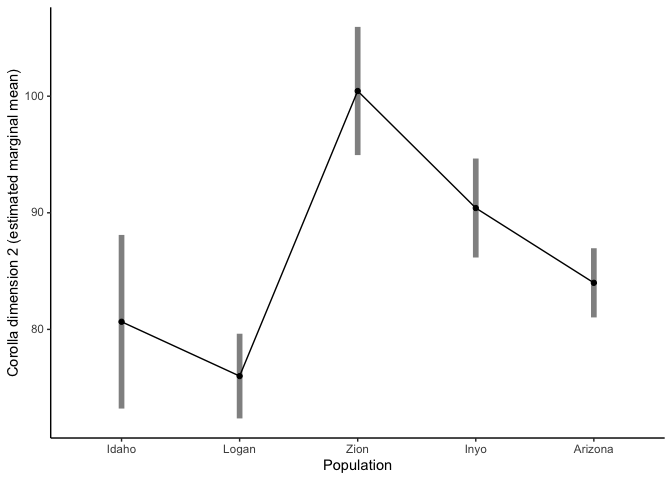<!-- -->

*Interpretation*: Zion has a significantly larger corolla dimension 2
relative to all other populations. Inyo and Arizona have the next
largest corolla D2, which is larger than Logan but comparable to Idaho.

**Tube Flare**:

Diagnostics for the model residuals:
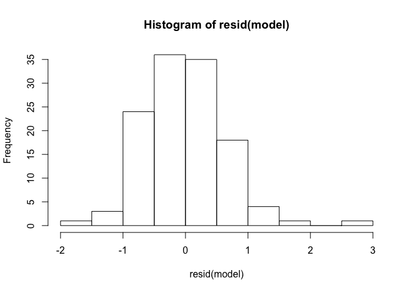<!-- -->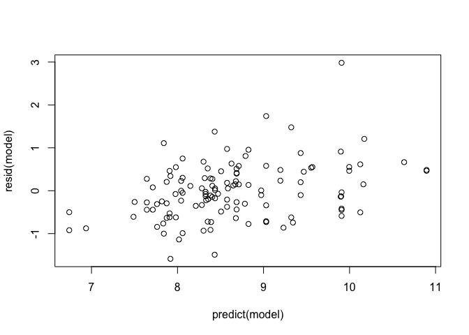<!-- -->

Model
    summary:

    ## Linear mixed model fit by REML. t-tests use Satterthwaite's method [
    ## lmerModLmerTest]
    ## Formula: M.Tube_Flare ~ Population + (1 | Pop_Plant)
    ##    Data: morph_names
    ## 
    ## REML criterion at convergence: 355.9
    ## 
    ## Scaled residuals: 
    ##     Min      1Q  Median      3Q     Max 
    ## -1.9706 -0.5496 -0.0465  0.5309  3.7018 
    ## 
    ## Random effects:
    ##  Groups    Name        Variance Std.Dev.
    ##  Pop_Plant (Intercept) 0.5962   0.7721  
    ##  Residual              0.6491   0.8057  
    ## Number of obs: 123, groups:  Pop_Plant, 67
    ## 
    ## Fixed effects:
    ##                   Estimate Std. Error      df t value Pr(>|t|)    
    ## (Intercept)         7.7413     0.4932 52.0680  15.697  < 2e-16 ***
    ## PopulationLogan     0.3058     0.5497 53.1611   0.556 0.580323    
    ## PopulationZion      2.2824     0.6215 60.1527   3.672 0.000513 ***
    ## PopulationInyo      1.3201     0.5714 55.8579   2.310 0.024600 *  
    ## PopulationArizona   0.7952     0.5310 52.3507   1.497 0.140307    
    ## ---
    ## Signif. codes:  0 '***' 0.001 '**' 0.01 '*' 0.05 '.' 0.1 ' ' 1
    ## 
    ## Correlation of Fixed Effects:
    ##             (Intr) PpltnL PpltnZ PpltnI
    ## PopulatnLgn -0.897                     
    ## PopulatinZn -0.793  0.712              
    ## PopulatnIny -0.863  0.774  0.685       
    ## PopultnArzn -0.929  0.833  0.737  0.801

ANOVA:

    ## Type III Analysis of Variance Table with Satterthwaite's method
    ##            Sum Sq Mean Sq NumDF  DenDF F value    Pr(>F)    
    ## Population 16.246  4.0615     4 61.203  6.2566 0.0002746 ***
    ## ---
    ## Signif. codes:  0 '***' 0.001 '**' 0.01 '*' 0.05 '.' 0.1 ' ' 1

Estimated marginal means & contrasts across populations:

    ## $emmeans
    ##  Population emmean    SE   df lower.CL upper.CL
    ##  Idaho        7.74 0.495 51.7     6.75     8.74
    ##  Logan        8.05 0.244 57.5     7.56     8.53
    ##  Zion        10.02 0.379 76.3     9.27    10.78
    ##  Inyo         9.06 0.289 68.2     8.48     9.64
    ##  Arizona      8.54 0.197 53.8     8.14     8.93
    ## 
    ## Degrees-of-freedom method: kenward-roger 
    ## Confidence level used: 0.95 
    ## 
    ## $contrasts
    ##  contrast        estimate    SE   df t.ratio p.value
    ##  Idaho - Logan     -0.306 0.552 52.8 -0.554  0.9810 
    ##  Idaho - Zion      -2.282 0.624 59.8 -3.660  0.0047 
    ##  Idaho - Inyo      -1.320 0.574 55.5 -2.301  0.1599 
    ##  Idaho - Arizona   -0.795 0.533 52.0 -1.491  0.5729 
    ##  Logan - Zion      -1.977 0.450 70.3 -4.390  0.0004 
    ##  Logan - Inyo      -1.014 0.378 63.6 -2.683  0.0678 
    ##  Logan - Arizona   -0.489 0.314 56.0 -1.561  0.5283 
    ##  Zion - Inyo        0.962 0.476 73.2  2.020  0.2671 
    ##  Zion - Arizona     1.487 0.427 70.9  3.482  0.0074 
    ##  Inyo - Arizona     0.525 0.350 63.2  1.499  0.5670 
    ## 
    ## Degrees-of-freedom method: kenward-roger 
    ## P value adjustment: tukey method for comparing a family of 5 estimates

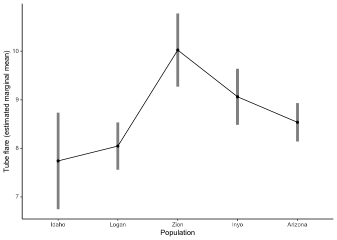<!-- -->

*Interpretation*: Zion is equal to Inyo, but greater than Arizona,
Logan, and Idaho. Inyo is equal to Arizona and Idaho, and marginally
larger than Logan. Idaho, Logan, and Arizona are equivalent.

**Stamen Length**:

Diagnostics for the model residuals:
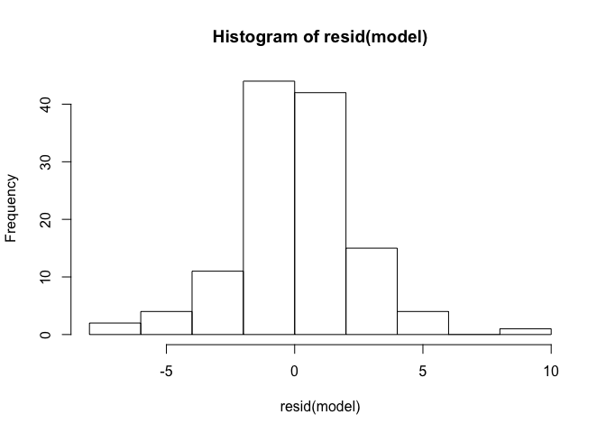<!-- -->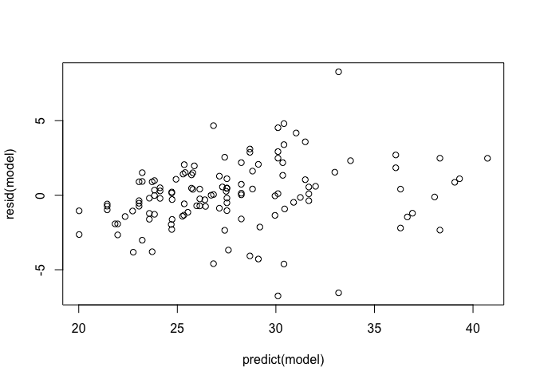<!-- -->

Model
    summary:

    ## Linear mixed model fit by REML. t-tests use Satterthwaite's method [
    ## lmerModLmerTest]
    ## Formula: M.Stamen_Length ~ Population + (1 | Pop_Plant)
    ##    Data: morph_names
    ## 
    ## REML criterion at convergence: 648.7
    ## 
    ## Scaled residuals: 
    ##      Min       1Q   Median       3Q      Max 
    ## -2.47049 -0.43019  0.00874  0.43536  3.02728 
    ## 
    ## Random effects:
    ##  Groups    Name        Variance Std.Dev.
    ##  Pop_Plant (Intercept) 7.728    2.780   
    ##  Residual              7.479    2.735   
    ## Number of obs: 123, groups:  Pop_Plant, 67
    ## 
    ## Fixed effects:
    ##                   Estimate Std. Error      df t value Pr(>|t|)    
    ## (Intercept)        27.2072     1.7404 53.2262  15.633  < 2e-16 ***
    ## PopulationLogan    -3.3777     1.9393 54.1841  -1.742   0.0872 .  
    ## PopulationZion     10.9699     2.1878 60.5919   5.014 4.94e-06 ***
    ## PopulationInyo      4.1889     2.0142 56.6639   2.080   0.0421 *  
    ## PopulationArizona  -0.4901     1.8739 53.4406  -0.262   0.7947    
    ## ---
    ## Signif. codes:  0 '***' 0.001 '**' 0.01 '*' 0.05 '.' 0.1 ' ' 1
    ## 
    ## Correlation of Fixed Effects:
    ##             (Intr) PpltnL PpltnZ PpltnI
    ## PopulatnLgn -0.897                     
    ## PopulatinZn -0.795  0.714              
    ## PopulatnIny -0.864  0.775  0.687       
    ## PopultnArzn -0.929  0.833  0.739  0.802

ANOVA:

    ## Type III Analysis of Variance Table with Satterthwaite's method
    ##            Sum Sq Mean Sq NumDF  DenDF F value    Pr(>F)    
    ## Population 729.05  182.26     4 61.505  24.371 4.109e-12 ***
    ## ---
    ## Signif. codes:  0 '***' 0.001 '**' 0.01 '*' 0.05 '.' 0.1 ' ' 1

Estimated marginal means & contrasts across populations:

    ## $emmeans
    ##  Population emmean    SE   df lower.CL upper.CL
    ##  Idaho        27.2 1.747 52.9     23.7     30.7
    ##  Logan        23.8 0.857 58.0     22.1     25.5
    ##  Zion         38.2 1.327 75.2     35.5     40.8
    ##  Inyo         31.4 1.015 67.8     29.4     33.4
    ##  Arizona      26.7 0.696 54.5     25.3     28.1
    ## 
    ## Degrees-of-freedom method: kenward-roger 
    ## Confidence level used: 0.95 
    ## 
    ## $contrasts
    ##  contrast        estimate   SE   df t.ratio p.value
    ##  Idaho - Logan       3.38 1.95 53.8  1.736  0.4215 
    ##  Idaho - Zion      -10.97 2.19 60.2 -5.000  0.0001 
    ##  Idaho - Inyo       -4.19 2.02 56.3 -2.073  0.2461 
    ##  Idaho - Arizona     0.49 1.88 53.1  0.261  0.9990 
    ##  Logan - Zion      -14.35 1.58 69.8 -9.081  <.0001 
    ##  Logan - Inyo       -7.57 1.33 63.5 -5.693  <.0001 
    ##  Logan - Arizona    -2.89 1.10 56.6 -2.614  0.0812 
    ##  Zion - Inyo         6.78 1.67 72.4  4.058  0.0011 
    ##  Zion - Arizona     11.46 1.50 70.3  7.647  <.0001 
    ##  Inyo - Arizona      4.68 1.23 63.2  3.800  0.0029 
    ## 
    ## Degrees-of-freedom method: kenward-roger 
    ## P value adjustment: tukey method for comparing a family of 5 estimates

<!-- -->

*Interpretation*: Zion has longer stamens then all other populations.
Inyo has longer stamens than Logan and Arizona, and comparable stamens
to Idaho. Idaho, Logan, and Arizona all have comparable stamens.

**Style Length**:

Diagnostics for the model residuals:
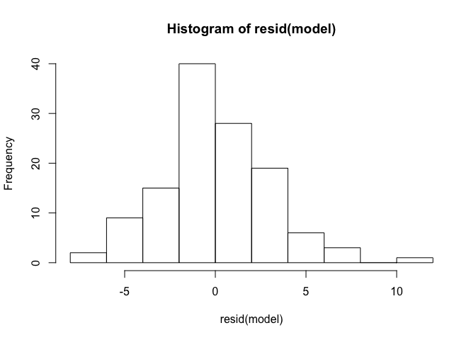<!-- -->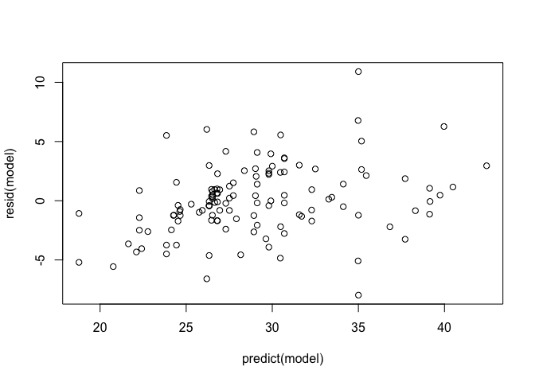<!-- -->

Model
    summary:

    ## Linear mixed model fit by REML. t-tests use Satterthwaite's method [
    ## lmerModLmerTest]
    ## Formula: M.Style_Length ~ Population + (1 | Pop_Plant)
    ##    Data: morph_names
    ## 
    ## REML criterion at convergence: 718
    ## 
    ## Scaled residuals: 
    ##      Min       1Q   Median       3Q      Max 
    ## -2.19257 -0.43689 -0.04113  0.42192  2.99925 
    ## 
    ## Random effects:
    ##  Groups    Name        Variance Std.Dev.
    ##  Pop_Plant (Intercept) 14.40    3.795   
    ##  Residual              13.22    3.636   
    ## Number of obs: 123, groups:  Pop_Plant, 67
    ## 
    ## Fixed effects:
    ##                   Estimate Std. Error     df t value Pr(>|t|)    
    ## (Intercept)         29.579      2.356 49.112  12.556  < 2e-16 ***
    ## PopulationLogan     -3.966      2.625 49.996  -1.511  0.13706    
    ## PopulationZion       9.650      2.958 56.092   3.262  0.00188 ** 
    ## PopulationInyo       3.561      2.725 52.347   1.307  0.19701    
    ## PopulationArizona   -2.757      2.537 49.295  -1.087  0.28236    
    ## ---
    ## Signif. codes:  0 '***' 0.001 '**' 0.01 '*' 0.05 '.' 0.1 ' ' 1
    ## 
    ## Correlation of Fixed Effects:
    ##             (Intr) PpltnL PpltnZ PpltnI
    ## PopulatnLgn -0.898                     
    ## PopulatinZn -0.796  0.715              
    ## PopulatnIny -0.865  0.776  0.688       
    ## PopultnArzn -0.929  0.834  0.740  0.803

ANOVA:

    ## Type III Analysis of Variance Table with Satterthwaite's method
    ##            Sum Sq Mean Sq NumDF  DenDF F value    Pr(>F)    
    ## Population 736.85  184.21     4 56.945   13.93 5.509e-08 ***
    ## ---
    ## Signif. codes:  0 '***' 0.001 '**' 0.01 '*' 0.05 '.' 0.1 ' ' 1

Estimated marginal means & contrasts across populations:

    ## $emmeans
    ##  Population emmean    SE   df lower.CL upper.CL
    ##  Idaho        29.6 2.364 53.4     24.8     34.3
    ##  Logan        25.6 1.160 58.2     23.3     27.9
    ##  Zion         39.2 1.791 74.8     35.7     42.8
    ##  Inyo         33.1 1.372 67.6     30.4     35.9
    ##  Arizona      26.8 0.942 54.8     24.9     28.7
    ## 
    ## Degrees-of-freedom method: kenward-roger 
    ## Confidence level used: 0.95 
    ## 
    ## $contrasts
    ##  contrast        estimate   SE   df t.ratio p.value
    ##  Idaho - Logan       3.97 2.63 54.3  1.506  0.5631 
    ##  Idaho - Zion       -9.65 2.97 60.4 -3.254  0.0155 
    ##  Idaho - Inyo       -3.56 2.73 56.7 -1.303  0.6906 
    ##  Idaho - Arizona     2.76 2.55 53.6  1.083  0.8143 
    ##  Logan - Zion      -13.62 2.13 69.5 -6.382  <.0001 
    ##  Logan - Inyo       -7.53 1.80 63.5 -4.191  0.0008 
    ##  Logan - Arizona    -1.21 1.49 56.8 -0.809  0.9267 
    ##  Zion - Inyo         6.09 2.26 72.1  2.699  0.0639 
    ##  Zion - Arizona     12.41 2.02 70.0  6.131  <.0001 
    ##  Inyo - Arizona      6.32 1.66 63.2  3.797  0.0030 
    ## 
    ## Degrees-of-freedom method: kenward-roger 
    ## P value adjustment: tukey method for comparing a family of 5 estimates

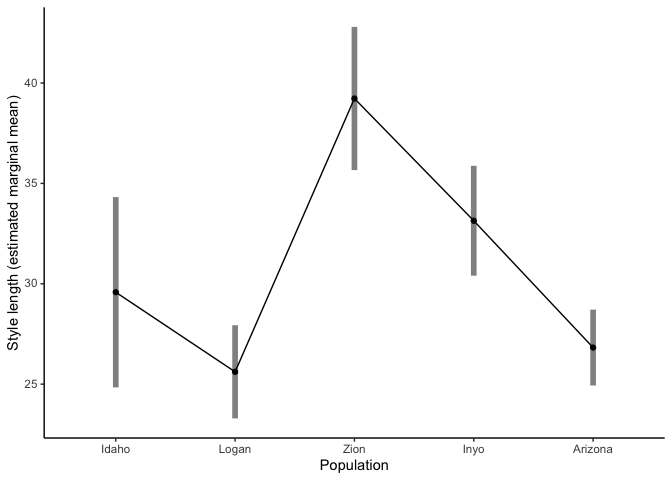<!-- -->

*Interpretation*: Zion has longer styles then all other populations
except Inyo. Inyo has longer stamens than Logan and Arizona, and
comparable styles to Idaho. Idaho, Logan, and Arizona all have
comparable styles.

**Hypanthium Length**:

Diagnostics for the model residuals:
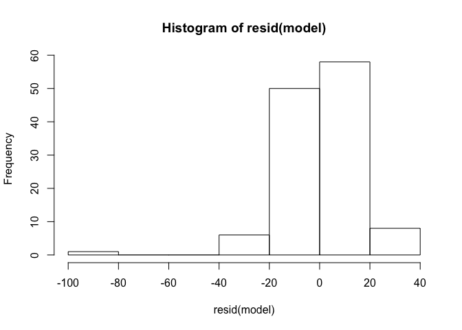<!-- -->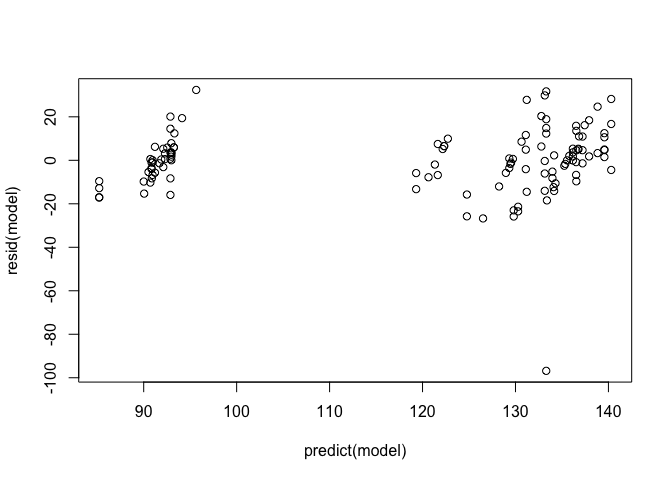<!-- -->

It looks like there is one outlier: rm2-28 (Arizona) the fifth flower,
measured on 6/19. It has a length of 36.48, but the other four flowers
from the plant all have lengths over 100. I suspect that the 100 digit
may have been dropped from this measurement. Can we either resolve this
from the paper datasheet or remove this outlier?

Model
    summary:

    ## Linear mixed model fit by REML. t-tests use Satterthwaite's method [
    ## lmerModLmerTest]
    ## Formula: M.Hypanthium_Length ~ Population + (1 | Pop_Plant)
    ##    Data: morph_names
    ## 
    ## REML criterion at convergence: 1014.7
    ## 
    ## Scaled residuals: 
    ##     Min      1Q  Median      3Q     Max 
    ## -6.0771 -0.4220  0.0368  0.3934  2.0305 
    ## 
    ## Random effects:
    ##  Groups    Name        Variance Std.Dev.
    ##  Pop_Plant (Intercept)  29.81    5.46   
    ##  Residual              253.87   15.93   
    ## Number of obs: 123, groups:  Pop_Plant, 67
    ## 
    ## Fixed effects:
    ##                   Estimate Std. Error      df t value Pr(>|t|)    
    ## (Intercept)        91.1503     6.0528 27.8283  15.059 6.64e-15 ***
    ## PopulationLogan     0.6978     6.8364 31.7140   0.102  0.91935    
    ## PopulationZion     30.4081     8.1318 48.2264   3.739  0.00049 ***
    ## PopulationInyo     38.4985     7.2559 37.6151   5.306 5.23e-06 ***
    ## PopulationArizona  44.3977     6.5574 29.8187   6.771 1.71e-07 ***
    ## ---
    ## Signif. codes:  0 '***' 0.001 '**' 0.01 '*' 0.05 '.' 0.1 ' ' 1
    ## 
    ## Correlation of Fixed Effects:
    ##             (Intr) PpltnL PpltnZ PpltnI
    ## PopulatnLgn -0.885                     
    ## PopulatinZn -0.744  0.659              
    ## PopulatnIny -0.834  0.739  0.621       
    ## PopultnArzn -0.923  0.817  0.687  0.770

ANOVA:

    ## Type III Analysis of Variance Table with Satterthwaite's method
    ##            Sum Sq Mean Sq NumDF  DenDF F value    Pr(>F)    
    ## Population  36680  9169.9     4 50.932  36.121 2.666e-14 ***
    ## ---
    ## Signif. codes:  0 '***' 0.001 '**' 0.01 '*' 0.05 '.' 0.1 ' ' 1

Estimated marginal means & contrasts across populations:

    ## $emmeans
    ##  Population emmean   SE   df lower.CL upper.CL
    ##  Idaho        91.2 6.25 23.9     78.2    104.1
    ##  Logan        91.8 3.21 47.6     85.4     98.3
    ##  Zion        121.6 5.45 93.8    110.7    132.4
    ##  Inyo        129.6 4.02 74.9    121.6    137.7
    ##  Arizona     135.5 2.55 40.4    130.4    140.7
    ## 
    ## Degrees-of-freedom method: kenward-roger 
    ## Confidence level used: 0.95 
    ## 
    ## $contrasts
    ##  contrast        estimate   SE   df t.ratio p.value
    ##  Idaho - Logan     -0.698 7.03 27.4  -0.099 1.0000 
    ##  Idaho - Zion     -30.408 8.29 42.8  -3.667 0.0058 
    ##  Idaho - Inyo     -38.499 7.43 32.8  -5.179 0.0001 
    ##  Idaho - Arizona  -44.398 6.75 25.7  -6.574 <.0001 
    ##  Logan - Zion     -29.710 6.32 80.0  -4.698 0.0001 
    ##  Logan - Inyo     -37.801 5.15 62.9  -7.341 <.0001 
    ##  Logan - Arizona  -43.700 4.11 44.7 -10.645 <.0001 
    ##  Zion - Inyo       -8.090 6.77 87.1  -1.195 0.7544 
    ##  Zion - Arizona   -13.990 6.02 81.9  -2.325 0.1474 
    ##  Inyo - Arizona    -5.899 4.77 62.9  -1.238 0.7295 
    ## 
    ## Degrees-of-freedom method: kenward-roger 
    ## P value adjustment: tukey method for comparing a family of 5 estimates

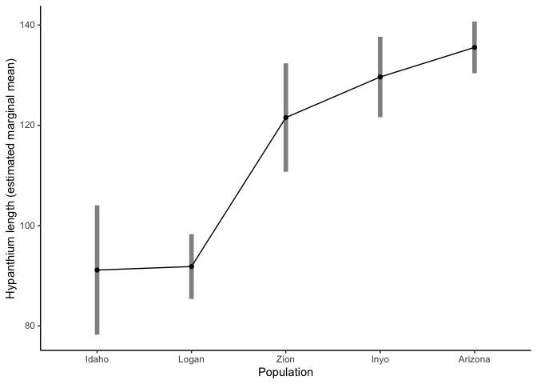<!-- -->

*Interpretation*: Clinal pattern. Idaho and Logan have the same lengths,
which are lower than the other three populations. Zion, Inyo, and
Arizona are all comparable.

**Pedicel length**:

*Note*: there are some potential outliers/zeros values that maybe should
be NAs in the dataset right now.

Diagnostics for the model residuals:
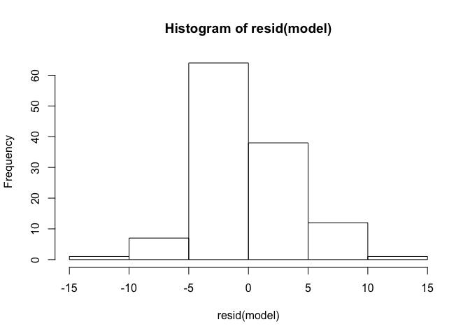<!-- -->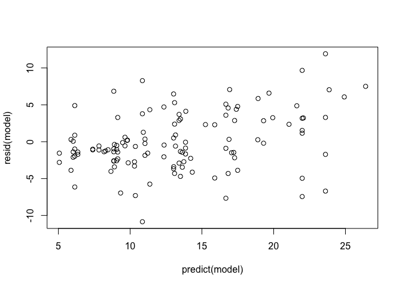<!-- -->

Model
    summary:

    ## Linear mixed model fit by REML. t-tests use Satterthwaite's method [
    ## lmerModLmerTest]
    ## Formula: M.Pedicel_Length ~ Population + (1 | Pop_Plant)
    ##    Data: morph_names
    ## 
    ## REML criterion at convergence: 782.6
    ## 
    ## Scaled residuals: 
    ##     Min      1Q  Median      3Q     Max 
    ## -2.2518 -0.4751 -0.1338  0.5967  2.4735 
    ## 
    ## Random effects:
    ##  Groups    Name        Variance Std.Dev.
    ##  Pop_Plant (Intercept) 24.11    4.910   
    ##  Residual              23.23    4.819   
    ## Number of obs: 123, groups:  Pop_Plant, 67
    ## 
    ## Fixed effects:
    ##                   Estimate Std. Error      df t value Pr(>|t|)    
    ## (Intercept)        18.7266     3.0718 45.4450   6.096 2.17e-07 ***
    ## PopulationLogan    -2.1700     3.4229 46.3583  -0.634  0.52921    
    ## PopulationZion     -0.1088     3.8612 52.5815  -0.028  0.97762    
    ## PopulationInyo     -5.8904     3.5549 48.7453  -1.657  0.10395    
    ## PopulationArizona  -9.1322     3.3075 45.6478  -2.761  0.00827 ** 
    ## ---
    ## Signif. codes:  0 '***' 0.001 '**' 0.01 '*' 0.05 '.' 0.1 ' ' 1
    ## 
    ## Correlation of Fixed Effects:
    ##             (Intr) PpltnL PpltnZ PpltnI
    ## PopulatnLgn -0.897                     
    ## PopulatinZn -0.796  0.714              
    ## PopulatnIny -0.864  0.775  0.687       
    ## PopultnArzn -0.929  0.833  0.739  0.803

ANOVA:

    ## Type III Analysis of Variance Table with Satterthwaite's method
    ##            Sum Sq Mean Sq NumDF  DenDF F value    Pr(>F)    
    ## Population 512.41   128.1     4 53.474  5.5153 0.0008594 ***
    ## ---
    ## Signif. codes:  0 '***' 0.001 '**' 0.01 '*' 0.05 '.' 0.1 ' ' 1

Estimated marginal means & contrasts across populations:

    ## $emmeans
    ##  Population emmean   SE   df lower.CL upper.CL
    ##  Idaho       18.73 3.08 52.9    12.54     24.9
    ##  Logan       16.56 1.51 58.0    13.53     19.6
    ##  Zion        18.62 2.34 75.2    13.95     23.3
    ##  Inyo        12.84 1.79 67.8     9.26     16.4
    ##  Arizona      9.59 1.23 54.5     7.13     12.1
    ## 
    ## Degrees-of-freedom method: kenward-roger 
    ## Confidence level used: 0.95 
    ## 
    ## $contrasts
    ##  contrast        estimate   SE   df t.ratio p.value
    ##  Idaho - Logan      2.170 3.43 53.9  0.632  0.9692 
    ##  Idaho - Zion       0.109 3.87 60.3  0.028  1.0000 
    ##  Idaho - Inyo       5.890 3.57 56.4  1.652  0.4717 
    ##  Idaho - Arizona    9.132 3.32 53.1  2.751  0.0596 
    ##  Logan - Zion      -2.061 2.79 69.8 -0.739  0.9465 
    ##  Logan - Inyo       3.720 2.35 63.5  1.586  0.5116 
    ##  Logan - Arizona    6.962 1.95 56.6  3.571  0.0063 
    ##  Zion - Inyo        5.782 2.95 72.4  1.961  0.2956 
    ##  Zion - Arizona     9.023 2.64 70.2  3.412  0.0092 
    ##  Inyo - Arizona     3.242 2.17 63.2  1.492  0.5715 
    ## 
    ## Degrees-of-freedom method: kenward-roger 
    ## P value adjustment: tukey method for comparing a family of 5 estimates

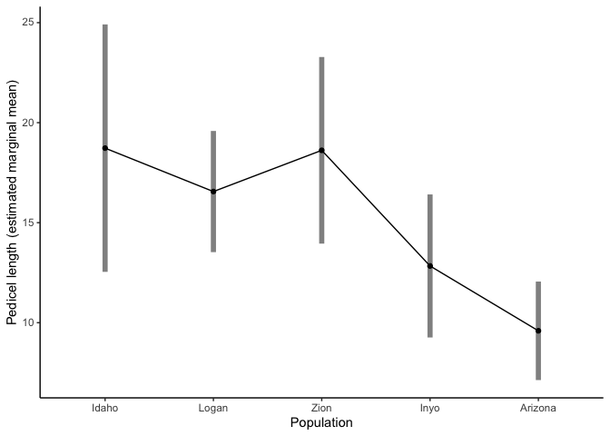<!-- -->

*Interpretation*: The only significant contrasts are that Logan and Zion
have larger pedicel lengths than Arizona.

**Nectar column**:

*Note*: there are some potential outliers/zeros values that maybe should
be NAs in the dataset right now.

Diagnostics for the model residuals:
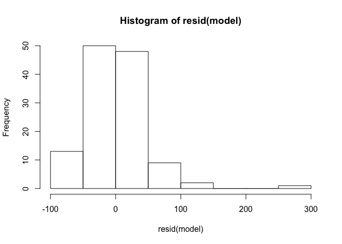<!-- -->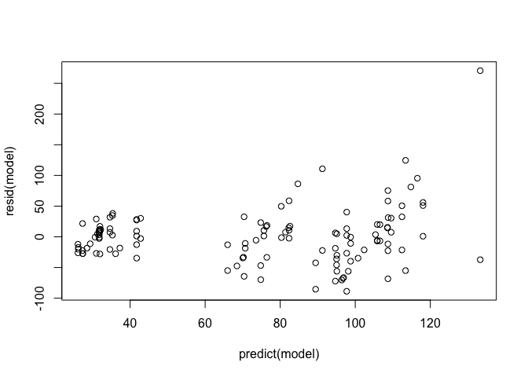<!-- -->

Model
    summary:

    ## Linear mixed model fit by REML. t-tests use Satterthwaite's method [
    ## lmerModLmerTest]
    ## Formula: M.Nectar_Column ~ Population + (1 | Pop_Plant)
    ##    Data: morph_names
    ## 
    ## REML criterion at convergence: 1279.5
    ## 
    ## Scaled residuals: 
    ##     Min      1Q  Median      3Q     Max 
    ## -1.8162 -0.5497 -0.0135  0.3524  5.5412 
    ## 
    ## Random effects:
    ##  Groups    Name        Variance Std.Dev.
    ##  Pop_Plant (Intercept)  289.8   17.02   
    ##  Residual              2386.5   48.85   
    ## Number of obs: 123, groups:  Pop_Plant, 67
    ## 
    ## Fixed effects:
    ##                   Estimate Std. Error     df t value Pr(>|t|)   
    ## (Intercept)         39.492     18.647 19.320   2.118  0.04736 * 
    ## PopulationLogan     -8.751     21.055 22.271  -0.416  0.68164   
    ## PopulationZion      41.000     25.024 35.784   1.638  0.11010   
    ## PopulationInyo      34.745     22.339 26.922   1.555  0.13154   
    ## PopulationArizona   65.472     20.198 20.819   3.241  0.00394 **
    ## ---
    ## Signif. codes:  0 '***' 0.001 '**' 0.01 '*' 0.05 '.' 0.1 ' ' 1
    ## 
    ## Correlation of Fixed Effects:
    ##             (Intr) PpltnL PpltnZ PpltnI
    ## PopulatnLgn -0.886                     
    ## PopulatinZn -0.745  0.660              
    ## PopulatnIny -0.835  0.739  0.622       
    ## PopultnArzn -0.923  0.818  0.688  0.771

ANOVA:

    ## Type III Analysis of Variance Table with Satterthwaite's method
    ##            Sum Sq Mean Sq NumDF  DenDF F value    Pr(>F)    
    ## Population  93205   23301     4 37.961  9.7636 1.566e-05 ***
    ## ---
    ## Signif. codes:  0 '***' 0.001 '**' 0.01 '*' 0.05 '.' 0.1 ' ' 1

Estimated marginal means & contrasts across populations:

    ## $emmeans
    ##  Population emmean    SE   df lower.CL upper.CL
    ##  Idaho        39.5 19.25 24.2    -0.21     79.2
    ##  Logan        30.7  9.88 47.7    10.86     50.6
    ##  Zion         80.5 16.74 93.6    47.25    113.7
    ##  Inyo         74.2 12.37 74.8    49.59     98.9
    ##  Arizona     105.0  7.86 40.6    89.08    120.8
    ## 
    ## Degrees-of-freedom method: kenward-roger 
    ## Confidence level used: 0.95 
    ## 
    ## $contrasts
    ##  contrast        estimate   SE   df t.ratio p.value
    ##  Idaho - Logan       8.75 21.6 27.7  0.404  0.9940 
    ##  Idaho - Zion      -41.00 25.5 43.1 -1.607  0.5010 
    ##  Idaho - Inyo      -34.74 22.9 33.1 -1.519  0.5581 
    ##  Idaho - Arizona   -65.47 20.8 26.0 -3.149  0.0305 
    ##  Logan - Zion      -49.75 19.4 79.9 -2.559  0.0880 
    ##  Logan - Inyo      -43.50 15.8 63.0 -2.747  0.0582 
    ##  Logan - Arizona   -74.22 12.6 44.8 -5.877  <.0001 
    ##  Zion - Inyo         6.25 20.8 86.9  0.301  0.9982 
    ##  Zion - Arizona    -24.47 18.5 81.8 -1.323  0.6776 
    ##  Inyo - Arizona    -30.73 14.7 62.9 -2.096  0.2345 
    ## 
    ## Degrees-of-freedom method: kenward-roger 
    ## P value adjustment: tukey method for comparing a family of 5 estimates

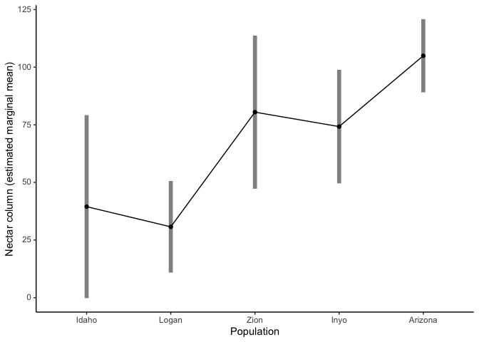<!-- -->

*Interpretation*: The only significant contrast is Logan is lower than
Arizona.

**Percent sugar**:

*Note*: there are some potential outliers/zeros values that maybe should
be NAs in the dataset right now.

Diagnostics for the model residuals:
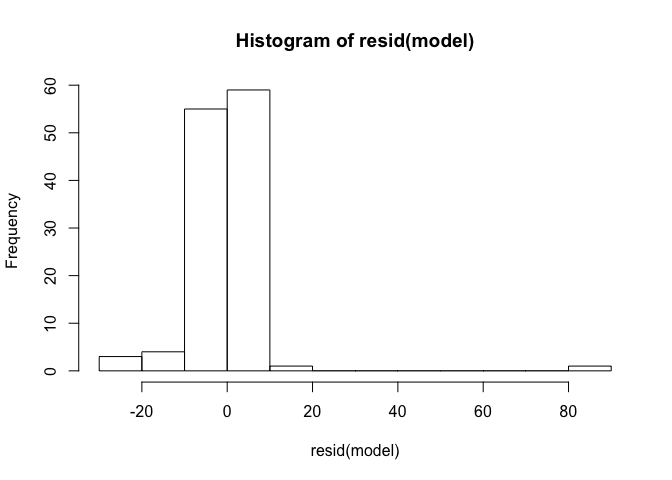<!-- -->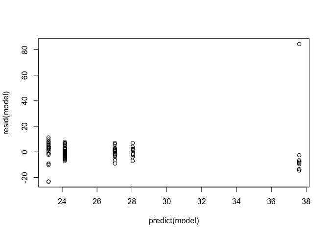<!-- -->

Model
    summary:

    ## Linear mixed model fit by REML. t-tests use Satterthwaite's method [
    ## lmerModLmerTest]
    ## Formula: M.Percent_Sugar ~ Population + (1 | Pop_Plant)
    ##    Data: morph_names
    ## 
    ## REML criterion at convergence: 891.6
    ## 
    ## Scaled residuals: 
    ##     Min      1Q  Median      3Q     Max 
    ## -2.3383 -0.2860 -0.0027  0.2866  8.4996 
    ## 
    ## Random effects:
    ##  Groups    Name        Variance Std.Dev.
    ##  Pop_Plant (Intercept)  0.0     0.00    
    ##  Residual              98.6     9.93    
    ## Number of obs: 123, groups:  Pop_Plant, 67
    ## 
    ## Fixed effects:
    ##                   Estimate Std. Error      df t value Pr(>|t|)    
    ## (Intercept)         37.600      3.140 118.000  11.974  < 2e-16 ***
    ## PopulationLogan    -14.381      3.597 118.000  -3.998 0.000112 ***
    ## PopulationZion      -9.550      4.441 118.000  -2.151 0.033554 *  
    ## PopulationInyo     -10.574      3.879 118.000  -2.726 0.007397 ** 
    ## PopulationArizona  -13.446      3.429 118.000  -3.922 0.000148 ***
    ## ---
    ## Signif. codes:  0 '***' 0.001 '**' 0.01 '*' 0.05 '.' 0.1 ' ' 1
    ## 
    ## Correlation of Fixed Effects:
    ##             (Intr) PpltnL PpltnZ PpltnI
    ## PopulatnLgn -0.873                     
    ## PopulatinZn -0.707  0.617              
    ## PopulatnIny -0.809  0.707  0.572       
    ## PopultnArzn -0.916  0.799  0.648  0.741
    ## convergence code: 0
    ## boundary (singular) fit: see ?isSingular

ANOVA:

    ## Type III Analysis of Variance Table with Satterthwaite's method
    ##            Sum Sq Mean Sq NumDF DenDF F value   Pr(>F)   
    ## Population 1825.6  456.39     4   118  4.6286 0.001659 **
    ## ---
    ## Signif. codes:  0 '***' 0.001 '**' 0.01 '*' 0.05 '.' 0.1 ' ' 1

Estimated marginal means & contrasts across populations:

    ## $emmeans
    ##  Population emmean   SE    df lower.CL upper.CL
    ##  Idaho        37.6 3.34  12.7     30.4     44.8
    ##  Logan        23.2 1.78  42.9     19.6     26.8
    ##  Zion         28.1 3.15 101.1     21.8     34.3
    ##  Inyo         27.0 2.29  78.8     22.5     31.6
    ##  Arizona      24.2 1.41  33.7     21.3     27.0
    ## 
    ## Degrees-of-freedom method: kenward-roger 
    ## Confidence level used: 0.95 
    ## 
    ## $contrasts
    ##  contrast        estimate   SE   df t.ratio p.value
    ##  Idaho - Logan     14.381 3.79 16.2  3.799  0.0116 
    ##  Idaho - Zion       9.550 4.59 31.9  2.081  0.2531 
    ##  Idaho - Inyo      10.574 4.05 21.4  2.611  0.1038 
    ##  Idaho - Arizona   13.446 3.62 14.6  3.711  0.0158 
    ##  Logan - Zion      -4.831 3.62 84.8 -1.335  0.6706 
    ##  Logan - Inyo      -3.808 2.91 63.0 -1.311  0.6857 
    ##  Logan - Arizona   -0.935 2.27 39.1 -0.411  0.9937 
    ##  Zion - Inyo        1.024 3.90 93.6  0.263  0.9989 
    ##  Zion - Arizona     3.896 3.45 87.0  1.129  0.7907 
    ##  Inyo - Arizona     2.872 2.69 62.7  1.067  0.8224 
    ## 
    ## Degrees-of-freedom method: kenward-roger 
    ## P value adjustment: tukey method for comparing a family of 5 estimates

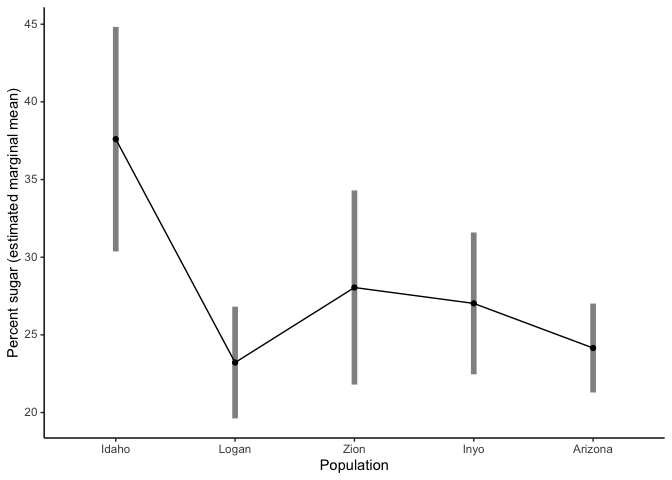<!-- -->

*Interpretation*: Idaho has higher percent sugar than Logan and Arizona,
and marginally higher relative to Inyo.

### Multivariate analysis of scent and morphology together

    ## 
    ## Call:
    ## adonis(formula = All_data ~ Population, data = All_data_names,      permutations = 999, method = "bray") 
    ## 
    ## Permutation: free
    ## Number of permutations: 999
    ## 
    ## Terms added sequentially (first to last)
    ## 
    ##             Df SumsOfSqs  MeanSqs F.Model      R2 Pr(>F)    
    ## Population   4    1.0453 0.261329  15.745 0.35189  0.001 ***
    ## Residuals  116    1.9253 0.016597         0.64811           
    ## Total      120    2.9706                  1.00000           
    ## ---
    ## Signif. codes:  0 '***' 0.001 '**' 0.01 '*' 0.05 '.' 0.1 ' ' 1

Population explains about 35 % of the variation in percent composition
of floral scent and in morphology. (As a reminder, population explained
about 21 % of variation in the scent only dataset, and about 44 $ of
variation in the morphology only dataset.)

Running a constrained analysis of principle coordinates:

    ## 
    ## Call:
    ## capscale(formula = All_data ~ Population, data = All_data_names,      distance = "bray") 
    ## 
    ## Partitioning of squared Bray distance:
    ##               Inertia Proportion
    ## Total           3.704     1.0000
    ## Constrained     1.061     0.2864
    ## Unconstrained   2.644     0.7136
    ## 
    ## Eigenvalues, and their contribution to the squared Bray distance 
    ## 
    ## Importance of components:
    ##                         CAP1    CAP2    CAP3     CAP4   MDS1   MDS2    MDS3
    ## Eigenvalue            0.7951 0.15056 0.08507 0.030101 0.5034 0.4648 0.21287
    ## Proportion Explained  0.2146 0.04064 0.02297 0.008126 0.1359 0.1255 0.05747
    ## Cumulative Proportion 0.2146 0.25527 0.27824 0.286362 0.4223 0.5477 0.60519
    ##                          MDS4    MDS5    MDS6    MDS7   MDS8    MDS9   MDS10
    ## Eigenvalue            0.18067 0.15667 0.13273 0.12405 0.1045 0.08579 0.08213
    ## Proportion Explained  0.04877 0.04229 0.03583 0.03349 0.0282 0.02316 0.02217
    ## Cumulative Proportion 0.65397 0.69626 0.73209 0.76558 0.7938 0.81694 0.83911
    ##                         MDS11   MDS12   MDS13   MDS14   MDS15    MDS16    MDS17
    ## Eigenvalue            0.06590 0.06371 0.04725 0.04650 0.04046 0.034321 0.031504
    ## Proportion Explained  0.01779 0.01720 0.01276 0.01255 0.01092 0.009265 0.008504
    ## Cumulative Proportion 0.85690 0.87410 0.88686 0.89941 0.91033 0.919600 0.928104
    ##                          MDS18    MDS19    MDS20    MDS21    MDS22    MDS23
    ## Eigenvalue            0.028040 0.024755 0.023117 0.021404 0.019181 0.014858
    ## Proportion Explained  0.007569 0.006683 0.006241 0.005778 0.005178 0.004011
    ## Cumulative Proportion 0.935673 0.942356 0.948596 0.954375 0.959552 0.963564
    ##                          MDS24    MDS25    MDS26    MDS27    MDS28    MDS29
    ## Eigenvalue            0.014464 0.013345 0.011156 0.010981 0.009643 0.009001
    ## Proportion Explained  0.003905 0.003603 0.003012 0.002964 0.002603 0.002430
    ## Cumulative Proportion 0.967468 0.971071 0.974082 0.977047 0.979650 0.982079
    ##                          MDS30    MDS31    MDS32    MDS33    MDS34    MDS35
    ## Eigenvalue            0.008403 0.007921 0.007627 0.006737 0.005130 0.004800
    ## Proportion Explained  0.002268 0.002138 0.002059 0.001819 0.001385 0.001296
    ## Cumulative Proportion 0.984348 0.986486 0.988545 0.990364 0.991749 0.993045
    ##                          MDS36    MDS37     MDS38     MDS39     MDS40     MDS41
    ## Eigenvalue            0.004281 0.004027 0.0034058 0.0028453 0.0024047 0.0019591
    ## Proportion Explained  0.001156 0.001087 0.0009194 0.0007681 0.0006492 0.0005289
    ## Cumulative Proportion 0.994200 0.995287 0.9962068 0.9969749 0.9976240 0.9981529
    ##                           MDS42     MDS43     MDS44     MDS45     MDS46
    ## Eigenvalue            0.0017540 0.0013611 0.0012118 0.0007853 0.0006208
    ## Proportion Explained  0.0004735 0.0003674 0.0003271 0.0002120 0.0001676
    ## Cumulative Proportion 0.9986264 0.9989938 0.9993209 0.9995329 0.9997005
    ##                           MDS47     MDS48     MDS49
    ## Eigenvalue            0.0005521 3.558e-04 2.015e-04
    ## Proportion Explained  0.0001490 9.604e-05 5.439e-05
    ## Cumulative Proportion 0.9998496 9.999e-01 1.000e+00
    ## 
    ## Accumulated constrained eigenvalues
    ## Importance of components:
    ##                         CAP1   CAP2    CAP3    CAP4
    ## Eigenvalue            0.7951 0.1506 0.08507 0.03010
    ## Proportion Explained  0.7495 0.1419 0.08020 0.02838
    ## Cumulative Proportion 0.7495 0.8914 0.97162 1.00000
    ## 
    ## Scaling 2 for species and site scores
    ## * Species are scaled proportional to eigenvalues
    ## * Sites are unscaled: weighted dispersion equal on all dimensions
    ## * General scaling constant of scores:

The constrained portion explains about 29% of overall distance. CAP1
explains about 21% and CAP2 expalins about 4% of overall distance.

Plotting the capscale:
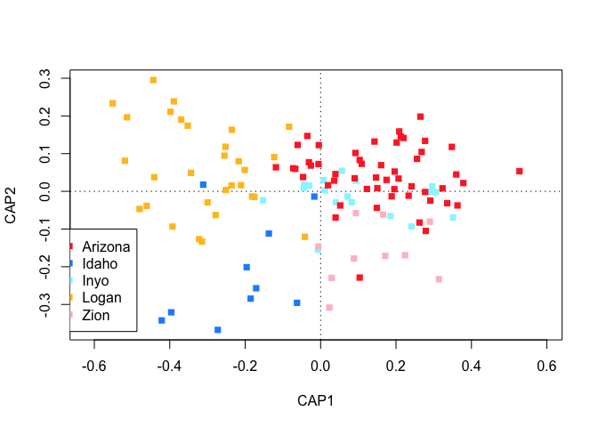<!-- -->

Checking to see which compound group(s) are significantly correlated
with CAP1 and/or
CAP2.

| variables                          | cor1     |     p1 | cor2     |     p2 | sig1 | sig2 |
| :--------------------------------- | :------- | -----: | :------- | -----: | :--- | :--- |
| M.Corolla\_D1                      | 0.4468   | 0.0000 | \-0.2509 | 0.0199 | Yes  | No   |
| M.Corolla\_D2                      | 0.6025   | 0.0000 | \-0.3419 | 0.0006 | Yes  | Yes  |
| M.Tube\_Flare                      | 0.3976   | 0.0000 | \-0.3712 | 0.0002 | Yes  | Yes  |
| M.Stamen\_Length                   | 0.4969   | 0.0000 | \-0.3763 | 0.0001 | Yes  | Yes  |
| M.Style\_Length                    | 0.3052   | 0.0026 | \-0.2878 | 0.0059 | Yes  | Yes  |
| M.Hypanthium\_Length               | 0.7833   | 0.0000 | 0.1658   | 0.1625 | Yes  | No   |
| M.Pedicel\_Length                  | \-0.4327 | 0.0000 | \-0.2143 | 0.0505 | Yes  | No   |
| M.Nectar\_Column                   | 0.7893   | 0.0000 | 0.0023   | 0.9875 | Yes  | No   |
| M.Percent\_Sugar                   | 0.0464   | 0.6702 | \-0.4667 | 0.0000 | No   | Yes  |
| Comp.2methylbutyronitrile          | 0.1497   | 0.1401 | \-0.5429 | 0.0000 | No   | Yes  |
| Comp.3methylbutyronitrile          | 0.2968   | 0.0032 | \-0.0119 | 0.9575 | Yes  | No   |
| Comp.b-myrcene                     | \-0.1097 | 0.2855 | \-0.0919 | 0.4956 | No   | No   |
| Comp.cis-b-ocimene                 | \-0.1635 | 0.1042 | 0.197    | 0.0792 | No   | No   |
| Comp.trans-b-ocimene               | \-0.0255 | 0.7809 | 0.2727   | 0.0097 | No   | Yes  |
| Comp.nitro-2-methyl-butane         | 0.1247   | 0.2196 | \-0.4895 | 0.0000 | No   | Yes  |
| Comp.nitro-3-methyl-butane         | 0.1663   | 0.1004 | \-0.1297 | 0.2826 | No   | No   |
| Comp.trans-isobutyraldoxime        | 0.0791   | 0.4423 | \-0.1217 | 0.3196 | No   | No   |
| Comp.cis-isobutyraldoxime          | 0.0895   | 0.3965 | \-0.1546 | 0.2024 | No   | No   |
| Comp.cis-furanoid-linalool-oxide   | \-0.218  | 0.0333 | \-0.135  | 0.2627 | No   | No   |
| Comp.trans-furanoid-linalool-oxide | \-0.1782 | 0.0792 | \-0.1927 | 0.0847 | No   | No   |
| Comp.pyran-lin-oxide-ketone        | \-0.2413 | 0.0164 | \-0.0922 | 0.4956 | No   | No   |
| Comp.trans-2-methylbutyraldoxime   | \-0.0444 | 0.6716 | \-0.733  | 0.0000 | No   | Yes  |
| Comp.trans-3-methylbutyraldoxime   | 0.3685   | 0.0002 | \-0.3019 | 0.0036 | Yes  | Yes  |
| Comp.cis-2-methylbutyraldoxime     | \-0.0268 | 0.7809 | \-0.7443 | 0.0000 | No   | Yes  |
| Comp.cis-3-methylbutyraldoxime     | 0.3492   | 0.0004 | \-0.2406 | 0.0264 | Yes  | No   |
| Comp.linalool                      | 0.2512   | 0.0128 | 0.5655   | 0.0000 | No   | Yes  |
| Comp.beta-caryophyllene            | \-0.1906 | 0.0704 | 0.0397   | 0.8450 | No   | No   |
| Comp.beta-farnesene                | \-0.2549 | 0.0118 | \-0.0309 | 0.8658 | No   | No   |
| Comp.alpha-humulene                | \-0.1269 | 0.2160 | 0.0479   | 0.7853 | No   | No   |
| Comp.neral                         | 0.2634   | 0.0092 | \-0.0285 | 0.8666 | Yes  | No   |
| Comp.alpha-terpineol               | \-0.1788 | 0.0792 | \-0.0096 | 0.9575 | No   | No   |
| Comp.Z-E-alpha-farnesene           | \-0.2982 | 0.0032 | 0.1006   | 0.4571 | Yes  | No   |
| Comp.geranial                      | 0.2825   | 0.0048 | \-0.0565 | 0.7226 | Yes  | No   |
| Comp.cis-pyranoid-linalool-oxide   | \-0.2819 | 0.0048 | \-0.1488 | 0.2207 | Yes  | No   |
| Comp.E-E-alpha-farnesene           | \-0.3669 | 0.0002 | 0.1409   | 0.2412 | Yes  | No   |
| Comp.citronellol                   | 0.1423   | 0.1605 | 0.0655   | 0.6570 | No   | No   |
| Comp.trans-pyranoid-linalool-oxide | \-0.1819 | 0.0792 | \-0.2168 | 0.0497 | No   | No   |
| Comp.nerol                         | 0.1797   | 0.0792 | 0.0816   | 0.5665 | No   | No   |
| Comp.geraniol                      | 0.1878   | 0.0708 | \-0.0312 | 0.8658 | No   | No   |
| Comp.2methylbutyl-benzoate         | NA       |     NA | NA       |     NA | NA   | NA   |
| Comp.2phenylethanol                | \-0.1663 | 0.1004 | \-0.0332 | 0.8658 | No   | No   |
| Comp.phenylacetonitrile            | \-0.2863 | 0.0046 | 0.0778   | 0.5822 | Yes  | No   |
| Comp.farnesene-epoxide             | \-0.1894 | 0.0704 | 0.1447   | 0.2318 | No   | No   |
| Comp.caryophyllene-oxide           | \-0.078  | 0.4423 | \-0.0014 | 0.9875 | No   | No   |
| Comp.nerolidol                     | \-0.2493 | 0.0130 | \-0.0754 | 0.5855 | No   | No   |
| Comp.nitrophenylethane             | \-0.0798 | 0.4423 | \-0.0176 | 0.9487 | No   | No   |
| Comp.phenylacetaldoxime            | NA       |     NA | NA       |     NA | NA   | NA   |
| Comp.isophytol                     | \-0.0335 | 0.7466 | 0.221    | 0.0465 | No   | No   |
| Comp.farnesol                      | \-0.3887 | 0.0001 | 0.0104   | 0.9575 | Yes  | No   |

Correlated with CAP 1: all morphological variables except percent sugar
(all + except Hypanthium length), 3methylbutyronitrile (+),
trans-3-methylbutyraldoxime (+), cis-3-methylbutyraldoxime (+), neral
(+), Z-E-alpha-farnesene (-), geranial (+), cis-pyranoid-linalool-oxide
(-), E-E-alpha-farnesene (-), phenylacetonitrile (-), farnesol (-)

Correlated with CAP 2: corolla D2 (-), Tube flare (-), stamen length
(-), style length (-), percent sugar (-), 2methylbutyronitrile (+),
trans-b-ocimene (+), nitro-2-methyl-butane (-),
trans-2-methylbutyraldoxime (-), trans-3-methylbutyraldoxime (-),
cis-2-methylbutyraldoxime (-), linalool (+).
